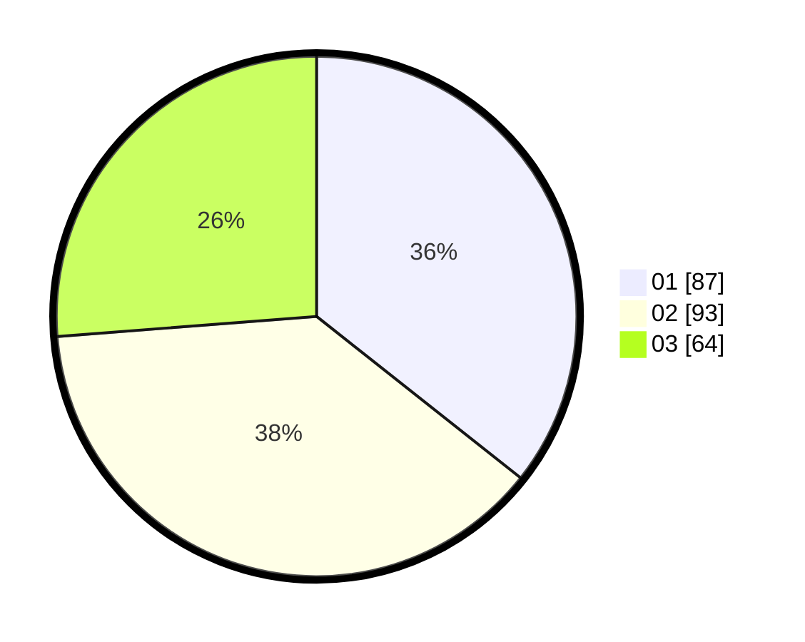

# Hasil

Hasil perolehan suara paslon dapat dilihat pada file paslon-01.txt, paslon-02.txt, dan paslon-03.txt.

Jika tidak ada, artinya data tersebut belum ada pada SIREKAP.

## Perolehan Suara

 * Paslon 01: **87**.
 * Paslon 02: **93**.
 * Paslon 03: **64**.

## Foto C Plano

https://sirekap-obj-formc.kpu.go.id/a985/pemilu/ppwp/31/71/03/10/01/3171031001020-20240216-143134--9c935afc-989c-48f5-8ab7-ed91c99be774.jpg

https://sirekap-obj-formc.kpu.go.id/a985/pemilu/ppwp/31/71/03/10/01/3171031001020-20240216-143136--60e21e80-920b-4c61-bb67-fb9b2983fb56.jpg

https://sirekap-obj-formc.kpu.go.id/a985/pemilu/ppwp/31/71/03/10/01/3171031001020-20240216-143135--fec4677b-61e3-4f2c-8049-53c636e859fa.jpg

## DATA PEMILIH TETAP

Jumlah pemilih dalam DPT: **297**.
 * L: **149**.
 * P: **148**.

## DATA PENGGUNA HAK PILIH

Jumlah pengguna hak pilih dalam DPT: **236**.
 * L: **115**.
 * P: **121**.

Jumlah pengguna hak pilih dalam DPTb: **10**.
 * L: **0**.
 * P: **10**.

Jumlah pengguna hak pilih dalam DPK: **4**.
 * L: **3**.
 * P: **1**.

Jumlah pengguna hak pilih: **250**.
 * L: **118**.
 * P: **132**.

## JUMLAH SUARA SAH DAN TIDAK SAH

JUMLAH SELURUH SUARA SAH: **244**.

JUMLAH SUARA TIDAK SAH: **6**.

JUMLAH SELURUH SUARA SAH DAN SUARA TIDAK SAH: **250**.
