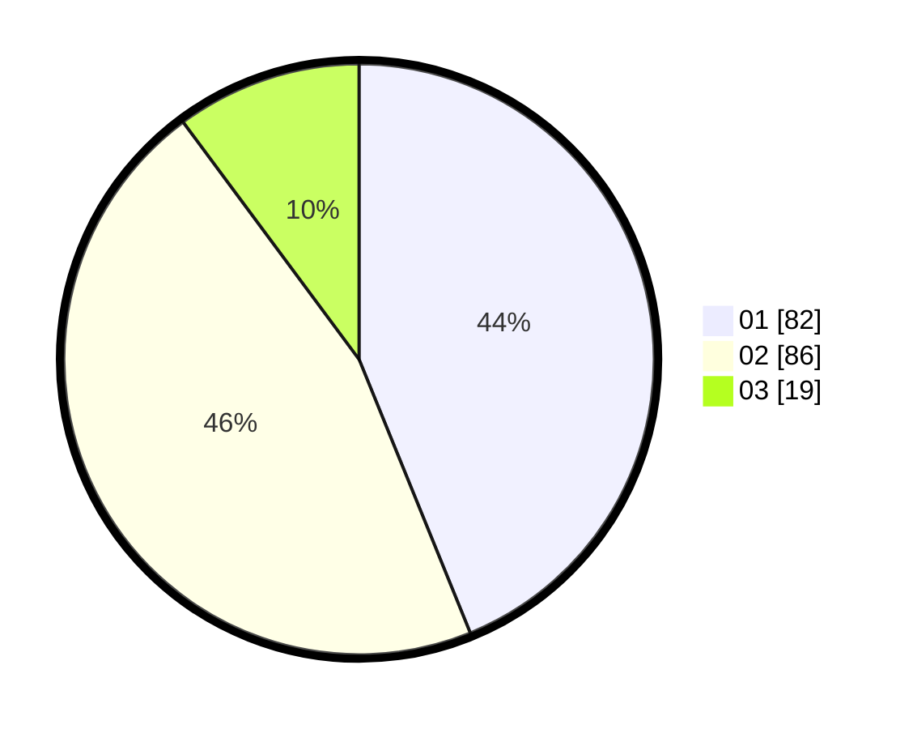

# Hasil

Hasil perolehan suara paslon dapat dilihat pada file paslon-01.txt, paslon-02.txt, dan paslon-03.txt.

Jika tidak ada, artinya data tersebut belum ada pada SIREKAP.

## Perolehan Suara

 * Paslon 01: **82**.
 * Paslon 02: **86**.
 * Paslon 03: **19**.

## Foto C Plano

https://sirekap-obj-formc.kpu.go.id/3229/pemilu/ppwp/31/71/03/10/01/3171031001025-20240216-004628--da82b16d-6860-4b14-a4a5-b4fd8a7c1c4d.jpg

https://sirekap-obj-formc.kpu.go.id/3229/pemilu/ppwp/31/71/03/10/01/3171031001025-20240216-004637--cd3aabcb-dd53-4709-8459-51c36b806da5.jpg

https://sirekap-obj-formc.kpu.go.id/3229/pemilu/ppwp/31/71/03/10/01/3171031001025-20240216-004634--dd11d91a-2123-49dd-9bf6-239064fee5ac.jpg

## DATA PEMILIH TETAP

Jumlah pemilih dalam DPT: **246**.
 * L: **129**.
 * P: **117**.

## DATA PENGGUNA HAK PILIH

Jumlah pengguna hak pilih dalam DPT: **186**.
 * L: **94**.
 * P: **92**.

Jumlah pengguna hak pilih dalam DPTb: **5**.
 * L: **2**.
 * P: **3**.

Jumlah pengguna hak pilih dalam DPK: **0**.
 * L: **0**.
 * P: **0**.

Jumlah pengguna hak pilih: **191**.
 * L: **96**.
 * P: **95**.

## JUMLAH SUARA SAH DAN TIDAK SAH

JUMLAH SELURUH SUARA SAH: **187**.

JUMLAH SUARA TIDAK SAH: **4**.

JUMLAH SELURUH SUARA SAH DAN SUARA TIDAK SAH: **191**.
