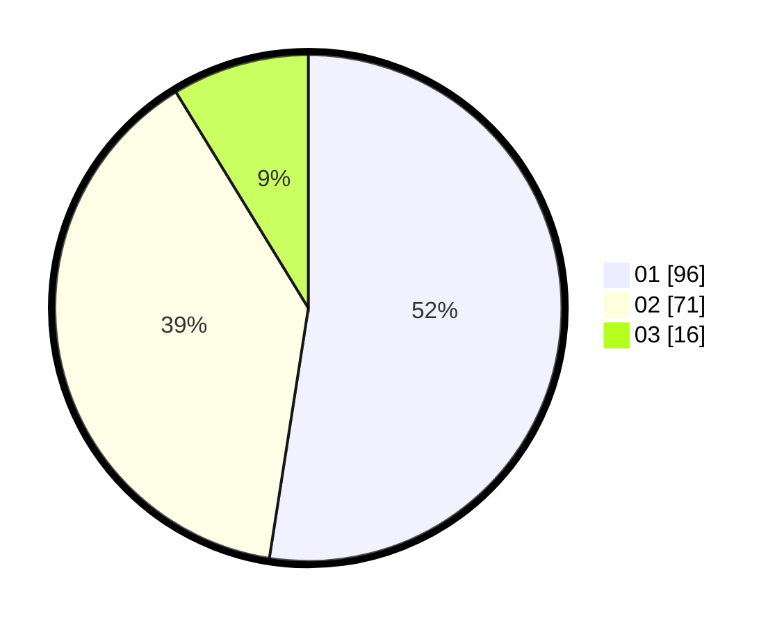

# Hasil

Hasil perolehan suara paslon dapat dilihat pada file paslon-01.txt, paslon-02.txt, dan paslon-03.txt.

Jika tidak ada, artinya data tersebut belum ada pada SIREKAP.

## Perolehan Suara

 * Paslon 01: **96**.
 * Paslon 02: **71**.
 * Paslon 03: **16**.

## Foto C Plano

https://sirekap-obj-formc.kpu.go.id/30c7/pemilu/ppwp/31/71/03/10/01/3171031001027-20240217-101637--005e1345-8f9f-411b-ad9a-d81617ea12ae.jpg

https://sirekap-obj-formc.kpu.go.id/30c7/pemilu/ppwp/31/71/03/10/01/3171031001027-20240217-101638--5e70d7ce-8220-4536-850c-8f7551ac058d.jpg

https://sirekap-obj-formc.kpu.go.id/30c7/pemilu/ppwp/31/71/03/10/01/3171031001027-20240217-101637--0c43a737-e312-41f7-8f6e-698cc78511e4.jpg

## DATA PEMILIH TETAP

Jumlah pemilih dalam DPT: **257**.
 * L: **124**.
 * P: **133**.

## DATA PENGGUNA HAK PILIH

Jumlah pengguna hak pilih dalam DPT: **186**.
 * L: **86**.
 * P: **100**.

Jumlah pengguna hak pilih dalam DPTb: **1**.
 * L: **1**.
 * P: **0**.

Jumlah pengguna hak pilih dalam DPK: **1**.
 * L: **0**.
 * P: **1**.

Jumlah pengguna hak pilih: **188**.
 * L: **87**.
 * P: **101**.

## JUMLAH SUARA SAH DAN TIDAK SAH

JUMLAH SELURUH SUARA SAH: **183**.

JUMLAH SUARA TIDAK SAH: **5**.

JUMLAH SELURUH SUARA SAH DAN SUARA TIDAK SAH: **188**.
