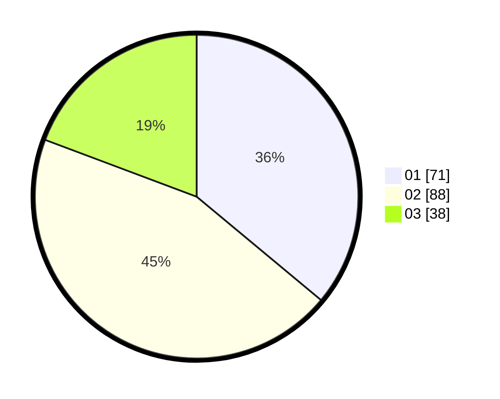

# Hasil

Hasil perolehan suara paslon dapat dilihat pada file paslon-01.txt, paslon-02.txt, dan paslon-03.txt.

Jika tidak ada, artinya data tersebut belum ada pada SIREKAP.

## Perolehan Suara

 * Paslon 01: **71**.
 * Paslon 02: **88**.
 * Paslon 03: **38**.

## Foto C Plano

https://sirekap-obj-formc.kpu.go.id/830f/pemilu/ppwp/31/71/03/10/01/3171031001030-20240214-234926--b524efb5-6dd9-43ce-b5ba-3e23df2e585f.jpg

https://sirekap-obj-formc.kpu.go.id/830f/pemilu/ppwp/31/71/03/10/01/3171031001030-20240214-230854--07636a7c-1f24-4251-a701-180d64a89468.jpg

https://sirekap-obj-formc.kpu.go.id/830f/pemilu/ppwp/31/71/03/10/01/3171031001030-20240214-230953--26b19b82-fa13-4f94-83cb-d217150567af.jpg

## DATA PEMILIH TETAP

Jumlah pemilih dalam DPT: **259**.
 * L: **133**.
 * P: **126**.

## DATA PENGGUNA HAK PILIH

Jumlah pengguna hak pilih dalam DPT: **196**.
 * L: **101**.
 * P: **95**.

Jumlah pengguna hak pilih dalam DPTb: **2**.
 * L: **1**.
 * P: **1**.

Jumlah pengguna hak pilih dalam DPK: **0**.
 * L: **0**.
 * P: **0**.

Jumlah pengguna hak pilih: **198**.
 * L: **102**.
 * P: **96**.

## JUMLAH SUARA SAH DAN TIDAK SAH

JUMLAH SELURUH SUARA SAH: **197**.

JUMLAH SUARA TIDAK SAH: **1**.

JUMLAH SELURUH SUARA SAH DAN SUARA TIDAK SAH: **198**.
