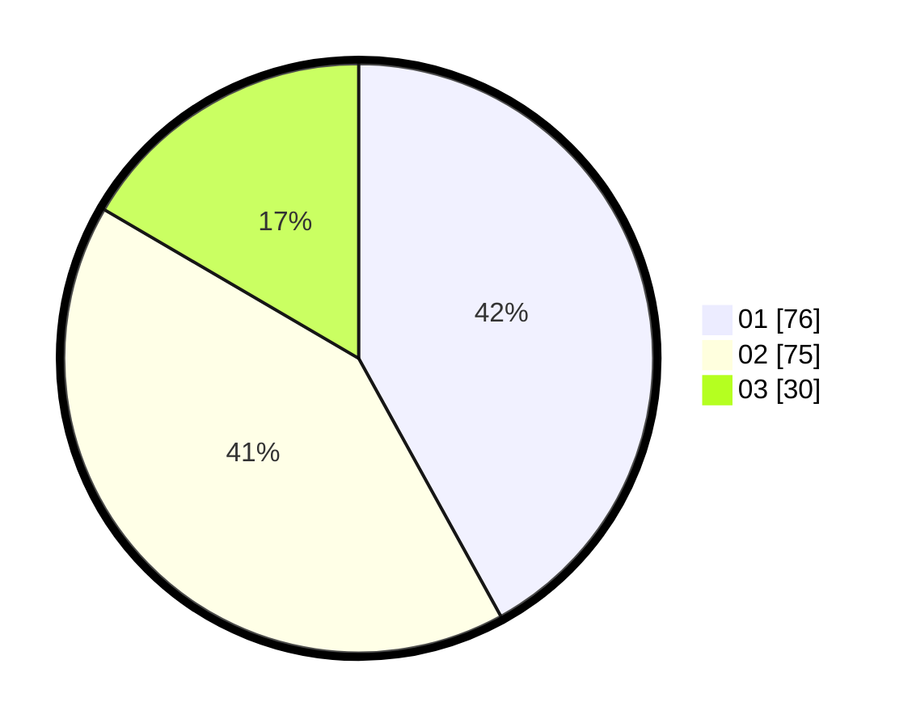

# Hasil

Hasil perolehan suara paslon dapat dilihat pada file paslon-01.txt, paslon-02.txt, dan paslon-03.txt.

Jika tidak ada, artinya data tersebut belum ada pada SIREKAP.

## Perolehan Suara

 * Paslon 01: **76**.
 * Paslon 02: **75**.
 * Paslon 03: **30**.

## Foto C Plano

https://sirekap-obj-formc.kpu.go.id/5553/pemilu/ppwp/31/71/03/10/01/3171031001031-20240217-101748--1575a9b6-8d82-4b32-b7f3-60936b0d3304.jpg

https://sirekap-obj-formc.kpu.go.id/5553/pemilu/ppwp/31/71/03/10/01/3171031001031-20240217-101750--d9449609-546b-4eff-ac88-f7f34a2fe27e.jpg

https://sirekap-obj-formc.kpu.go.id/5553/pemilu/ppwp/31/71/03/10/01/3171031001031-20240217-101749--3ac2f9f6-c60c-4562-96ff-29a2c872c2a5.jpg

## DATA PEMILIH TETAP

Jumlah pemilih dalam DPT: **183**.
 * L: **87**.
 * P: **96**.

## DATA PENGGUNA HAK PILIH

Jumlah pengguna hak pilih dalam DPT: **182**.
 * L: **87**.
 * P: **95**.

Jumlah pengguna hak pilih dalam DPTb: **1**.
 * L: **0**.
 * P: **1**.

Jumlah pengguna hak pilih dalam DPK: **0**.
 * L: **0**.
 * P: **0**.

Jumlah pengguna hak pilih: **183**.
 * L: **87**.
 * P: **96**.

## JUMLAH SUARA SAH DAN TIDAK SAH

JUMLAH SELURUH SUARA SAH: **181**.

JUMLAH SUARA TIDAK SAH: **2**.

JUMLAH SELURUH SUARA SAH DAN SUARA TIDAK SAH: **183**.
