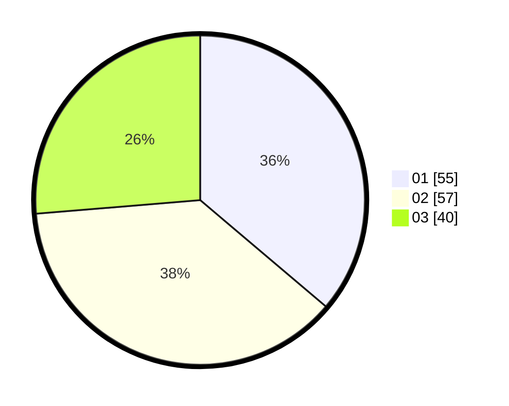

# Hasil

Hasil perolehan suara paslon dapat dilihat pada file paslon-01.txt, paslon-02.txt, dan paslon-03.txt.

Jika tidak ada, artinya data tersebut belum ada pada SIREKAP.

## Perolehan Suara

 * Paslon 01: **55**.
 * Paslon 02: **57**.
 * Paslon 03: **40**.

## Foto C Plano

https://sirekap-obj-formc.kpu.go.id/6d3a/pemilu/ppwp/31/71/03/10/01/3171031001032-20240217-101835--361211f0-1346-40ef-897f-94aa26d440a1.jpg

https://sirekap-obj-formc.kpu.go.id/6d3a/pemilu/ppwp/31/71/03/10/01/3171031001032-20240217-101837--96623cf9-d980-4ec8-b89c-104d58d20e0c.jpg

https://sirekap-obj-formc.kpu.go.id/6d3a/pemilu/ppwp/31/71/03/10/01/3171031001032-20240217-101836--e26ddb2c-b224-4b7a-b56f-5a71154c047d.jpg

## DATA PEMILIH TETAP

Jumlah pemilih dalam DPT: **254**.
 * L: **126**.
 * P: **128**.

## DATA PENGGUNA HAK PILIH

Jumlah pengguna hak pilih dalam DPT: **148**.
 * L: **66**.
 * P: **82**.

Jumlah pengguna hak pilih dalam DPTb: **3**.
 * L: **2**.
 * P: **1**.

Jumlah pengguna hak pilih dalam DPK: **2**.
 * L: **1**.
 * P: **1**.

Jumlah pengguna hak pilih: **153**.
 * L: **69**.
 * P: **84**.

## JUMLAH SUARA SAH DAN TIDAK SAH

JUMLAH SELURUH SUARA SAH: **152**.

JUMLAH SUARA TIDAK SAH: **1**.

JUMLAH SELURUH SUARA SAH DAN SUARA TIDAK SAH: **153**.
