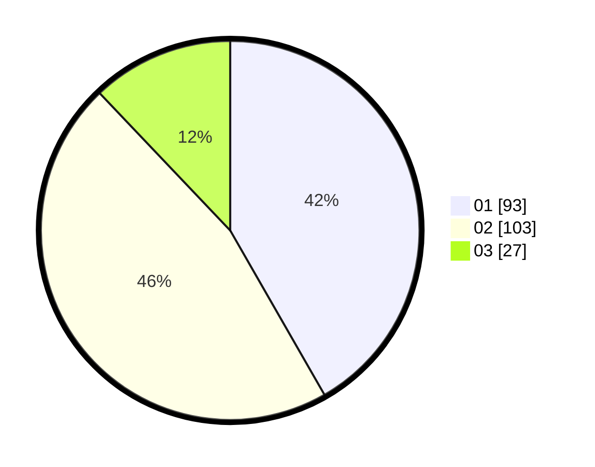

# Hasil

Hasil perolehan suara paslon dapat dilihat pada file paslon-01.txt, paslon-02.txt, dan paslon-03.txt.

Jika tidak ada, artinya data tersebut belum ada pada SIREKAP.

## Perolehan Suara

 * Paslon 01: **93**.
 * Paslon 02: **103**.
 * Paslon 03: **27**.

## Foto C Plano

https://sirekap-obj-formc.kpu.go.id/d7ad/pemilu/ppwp/31/71/03/10/01/3171031001036-20240214-214759--1052f8ab-0878-44e0-bee5-83bb94dec1df.jpg

https://sirekap-obj-formc.kpu.go.id/d7ad/pemilu/ppwp/31/71/03/10/01/3171031001036-20240214-214914--72ef4a35-4360-4ba1-883f-152537335961.jpg

https://sirekap-obj-formc.kpu.go.id/d7ad/pemilu/ppwp/31/71/03/10/01/3171031001036-20240214-215007--2ffa7790-07c9-4632-bdec-2f905f418ba1.jpg

## DATA PEMILIH TETAP

Jumlah pemilih dalam DPT: **280**.
 * L: **140**.
 * P: **140**.

## DATA PENGGUNA HAK PILIH

Jumlah pengguna hak pilih dalam DPT: **232**.
 * L: **113**.
 * P: **119**.

Jumlah pengguna hak pilih dalam DPTb: **1**.
 * L: **1**.
 * P: **0**.

Jumlah pengguna hak pilih dalam DPK: **0**.
 * L: **0**.
 * P: **0**.

Jumlah pengguna hak pilih: **233**.
 * L: **114**.
 * P: **119**.

## JUMLAH SUARA SAH DAN TIDAK SAH

JUMLAH SELURUH SUARA SAH: **223**.

JUMLAH SUARA TIDAK SAH: **10**.

JUMLAH SELURUH SUARA SAH DAN SUARA TIDAK SAH: **233**.
