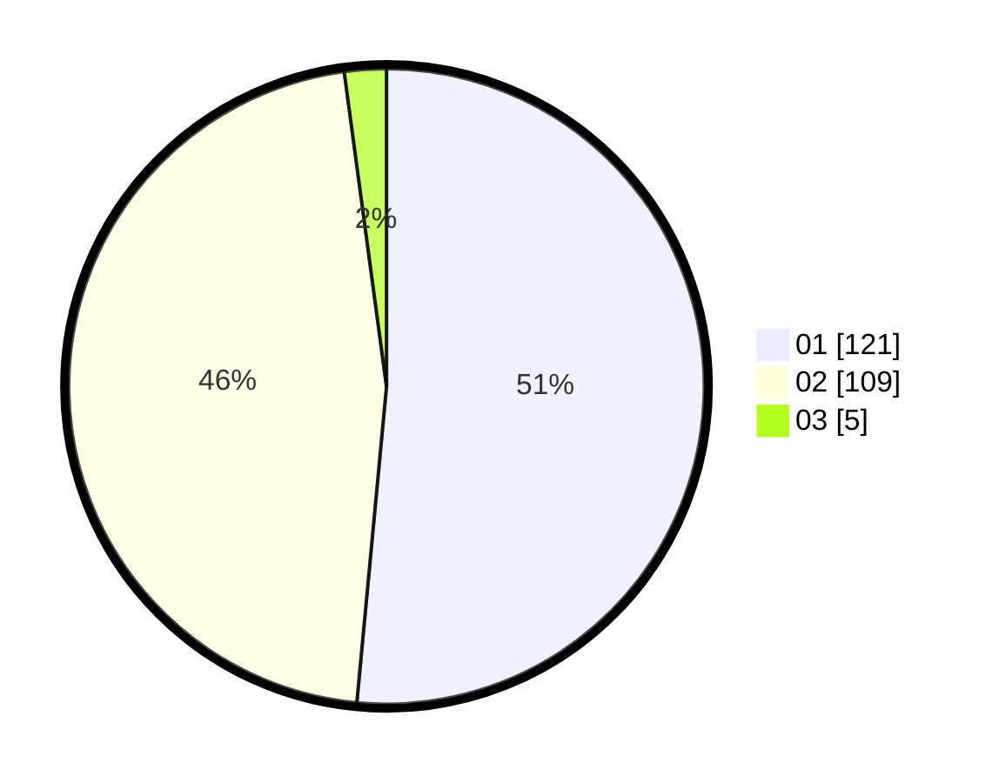

# Hasil

Hasil perolehan suara paslon dapat dilihat pada file paslon-01.txt, paslon-02.txt, dan paslon-03.txt.

Jika tidak ada, artinya data tersebut belum ada pada SIREKAP.

## Perolehan Suara

 * Paslon 01: **121**.
 * Paslon 02: **109**.
 * Paslon 03: **5**.

## Foto C Plano

https://sirekap-obj-formc.kpu.go.id/eea4/pemilu/ppwp/31/71/03/10/01/3171031001037-20240218-200147--8b573fd5-8760-47a0-b3b8-44f2c3271f01.jpg

https://sirekap-obj-formc.kpu.go.id/eea4/pemilu/ppwp/31/71/03/10/01/3171031001037-20240217-064602--65b63c51-540f-4680-8ce2-563ca55cdc48.jpg

https://sirekap-obj-formc.kpu.go.id/eea4/pemilu/ppwp/31/71/03/10/01/3171031001037-20240217-064602--3c0cd81c-5d47-4e95-84e8-41fccab7fb52.jpg

## DATA PEMILIH TETAP

Jumlah pemilih dalam DPT: **293**.
 * L: **139**.
 * P: **154**.

## DATA PENGGUNA HAK PILIH

Jumlah pengguna hak pilih dalam DPT: **242**.
 * L: **113**.
 * P: **129**.

Jumlah pengguna hak pilih dalam DPTb: **0**.
 * L: **0**.
 * P: **0**.

Jumlah pengguna hak pilih dalam DPK: **4**.
 * L: **2**.
 * P: **2**.

Jumlah pengguna hak pilih: **246**.
 * L: **115**.
 * P: **131**.

## JUMLAH SUARA SAH DAN TIDAK SAH

JUMLAH SELURUH SUARA SAH: **235**.

JUMLAH SUARA TIDAK SAH: **11**.

JUMLAH SELURUH SUARA SAH DAN SUARA TIDAK SAH: **246**.
