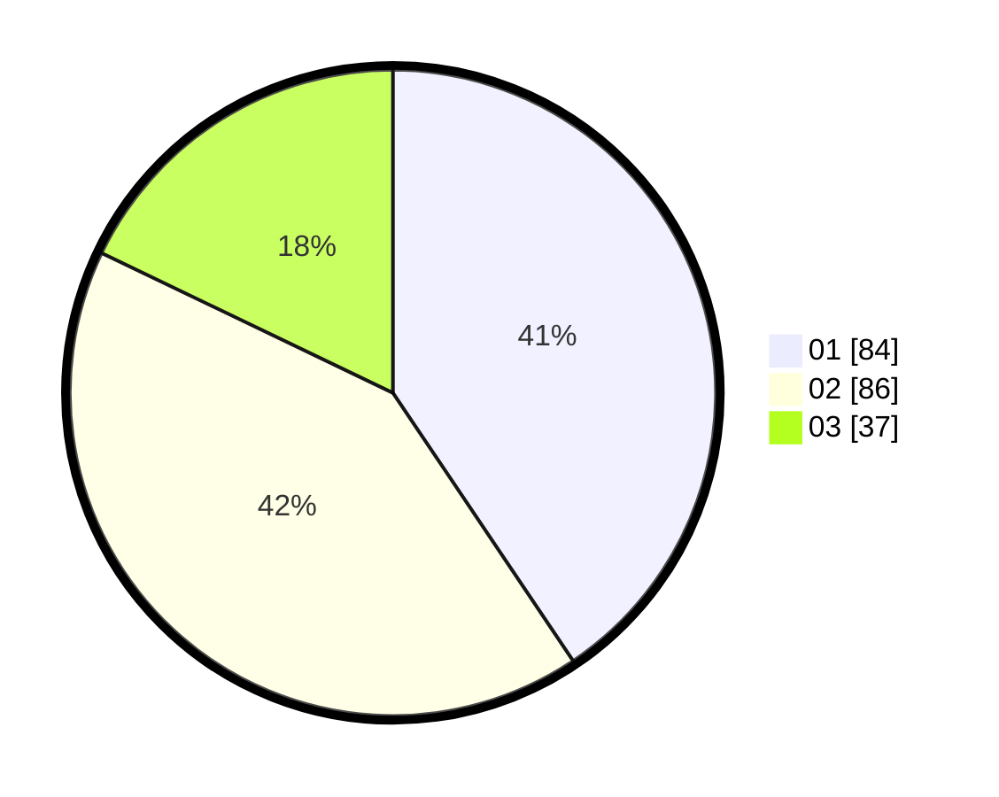

# Hasil

Hasil perolehan suara paslon dapat dilihat pada file paslon-01.txt, paslon-02.txt, dan paslon-03.txt.

Jika tidak ada, artinya data tersebut belum ada pada SIREKAP.

## Perolehan Suara

 * Paslon 01: **84**.
 * Paslon 02: **86**.
 * Paslon 03: **37**.

## Foto C Plano

https://sirekap-obj-formc.kpu.go.id/85f9/pemilu/ppwp/31/71/03/10/01/3171031001045-20240214-202753--1a116478-aeda-495f-8e94-fb083832ae92.jpg

https://sirekap-obj-formc.kpu.go.id/85f9/pemilu/ppwp/31/71/03/10/01/3171031001045-20240214-192945--d54c5d5c-ef13-442b-a04a-0ccaf9ac0239.jpg

https://sirekap-obj-formc.kpu.go.id/85f9/pemilu/ppwp/31/71/03/10/01/3171031001045-20240214-203054--b34370ce-0e9b-4b37-beec-8e12e2a6307d.jpg

## DATA PEMILIH TETAP

Jumlah pemilih dalam DPT: **288**.
 * L: **140**.
 * P: **148**.

## DATA PENGGUNA HAK PILIH

Jumlah pengguna hak pilih dalam DPT: **206**.
 * L: **100**.
 * P: **106**.

Jumlah pengguna hak pilih dalam DPTb: **1**.
 * L: **1**.
 * P: **0**.

Jumlah pengguna hak pilih dalam DPK: **1**.
 * L: **1**.
 * P: **0**.

Jumlah pengguna hak pilih: **208**.
 * L: **102**.
 * P: **106**.

## JUMLAH SUARA SAH DAN TIDAK SAH

JUMLAH SELURUH SUARA SAH: **207**.

JUMLAH SUARA TIDAK SAH: **1**.

JUMLAH SELURUH SUARA SAH DAN SUARA TIDAK SAH: **208**.
