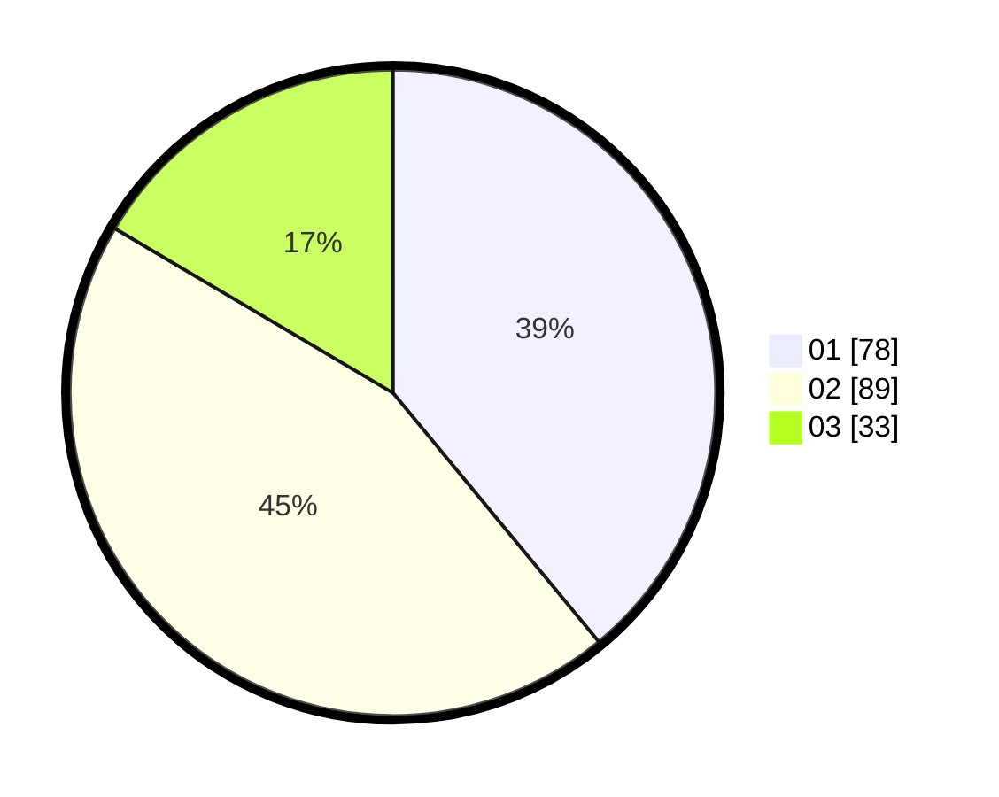

# Hasil

Hasil perolehan suara paslon dapat dilihat pada file paslon-01.txt, paslon-02.txt, dan paslon-03.txt.

Jika tidak ada, artinya data tersebut belum ada pada SIREKAP.

## Perolehan Suara

 * Paslon 01: **78**.
 * Paslon 02: **89**.
 * Paslon 03: **33**.

## Foto C Plano

https://sirekap-obj-formc.kpu.go.id/45bc/pemilu/ppwp/31/71/03/10/01/3171031001047-20240216-145116--f6c9e888-3c68-4e67-9e7e-e18240090154.jpg

https://sirekap-obj-formc.kpu.go.id/45bc/pemilu/ppwp/31/71/03/10/01/3171031001047-20240216-145126--e6b286ba-732a-4373-a814-9fb22efd550f.jpg

https://sirekap-obj-formc.kpu.go.id/45bc/pemilu/ppwp/31/71/03/10/01/3171031001047-20240216-145131--8a33919e-00a9-4869-ad77-e3e5d224a091.jpg

## DATA PEMILIH TETAP

Jumlah pemilih dalam DPT: **292**.
 * L: **143**.
 * P: **149**.

## DATA PENGGUNA HAK PILIH

Jumlah pengguna hak pilih dalam DPT: **200**.
 * L: **93**.
 * P: **107**.

Jumlah pengguna hak pilih dalam DPTb: **2**.
 * L: **0**.
 * P: **2**.

Jumlah pengguna hak pilih dalam DPK: **4**.
 * L: **2**.
 * P: **2**.

Jumlah pengguna hak pilih: **206**.
 * L: **95**.
 * P: **111**.

## JUMLAH SUARA SAH DAN TIDAK SAH

JUMLAH SELURUH SUARA SAH: **200**.

JUMLAH SUARA TIDAK SAH: **6**.

JUMLAH SELURUH SUARA SAH DAN SUARA TIDAK SAH: **206**.
