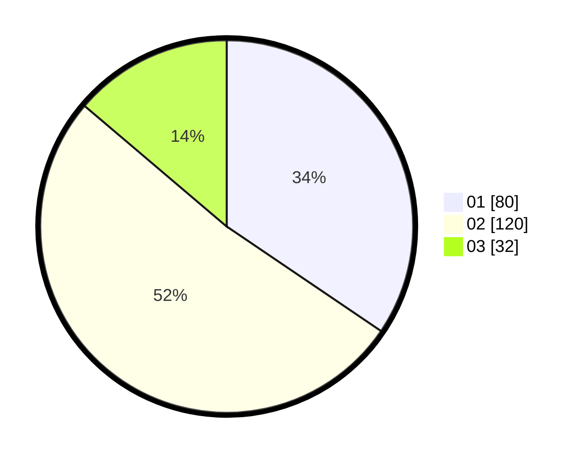

# Hasil

Hasil perolehan suara paslon dapat dilihat pada file paslon-01.txt, paslon-02.txt, dan paslon-03.txt.

Jika tidak ada, artinya data tersebut belum ada pada SIREKAP.

## Perolehan Suara

 * Paslon 01: **80**.
 * Paslon 02: **120**.
 * Paslon 03: **32**.

## Foto C Plano

https://sirekap-obj-formc.kpu.go.id/dd83/pemilu/ppwp/31/71/03/10/01/3171031001048-20240216-180806--fdd1eabd-6948-40b7-a6be-6bc5b856b478.jpg

https://sirekap-obj-formc.kpu.go.id/dd83/pemilu/ppwp/31/71/03/10/01/3171031001048-20240216-180807--533f2de2-afdd-4e75-bc1e-259dbc23f63c.jpg

https://sirekap-obj-formc.kpu.go.id/dd83/pemilu/ppwp/31/71/03/10/01/3171031001048-20240216-180806--7a2fa147-b0bd-4392-b209-decbc219292a.jpg

## DATA PEMILIH TETAP

Jumlah pemilih dalam DPT: **297**.
 * L: **150**.
 * P: **147**.

## DATA PENGGUNA HAK PILIH

Jumlah pengguna hak pilih dalam DPT: **233**.
 * L: **115**.
 * P: **118**.

Jumlah pengguna hak pilih dalam DPTb: **1**.
 * L: **1**.
 * P: **0**.

Jumlah pengguna hak pilih dalam DPK: **0**.
 * L: **0**.
 * P: **0**.

Jumlah pengguna hak pilih: **234**.
 * L: **116**.
 * P: **118**.

## JUMLAH SUARA SAH DAN TIDAK SAH

JUMLAH SELURUH SUARA SAH: **232**.

JUMLAH SUARA TIDAK SAH: **2**.

JUMLAH SELURUH SUARA SAH DAN SUARA TIDAK SAH: **234**.
