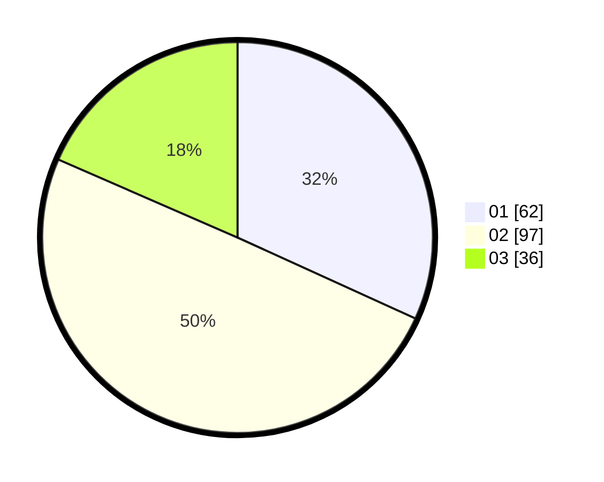

# Hasil

Hasil perolehan suara paslon dapat dilihat pada file paslon-01.txt, paslon-02.txt, dan paslon-03.txt.

Jika tidak ada, artinya data tersebut belum ada pada SIREKAP.

## Perolehan Suara

 * Paslon 01: **62**.
 * Paslon 02: **97**.
 * Paslon 03: **36**.

## Foto C Plano

https://sirekap-obj-formc.kpu.go.id/c079/pemilu/ppwp/31/71/03/10/01/3171031001050-20240216-222111--971db833-aaa7-4e83-b85a-55b312dfb871.jpg

https://sirekap-obj-formc.kpu.go.id/c079/pemilu/ppwp/31/71/03/10/01/3171031001050-20240216-222900--722f85e8-fb3c-40c7-b6eb-342482069717.jpg

https://sirekap-obj-formc.kpu.go.id/c079/pemilu/ppwp/31/71/03/10/01/3171031001050-20240216-223621--58dd67e3-0743-4df5-b49f-851c1c1a4e34.jpg

## DATA PEMILIH TETAP

Jumlah pemilih dalam DPT: **292**.
 * L: **148**.
 * P: **144**.

## DATA PENGGUNA HAK PILIH

Jumlah pengguna hak pilih dalam DPT: **197**.
 * L: **92**.
 * P: **105**.

Jumlah pengguna hak pilih dalam DPTb: **1**.
 * L: **1**.
 * P: **0**.

Jumlah pengguna hak pilih dalam DPK: **0**.
 * L: **0**.
 * P: **0**.

Jumlah pengguna hak pilih: **198**.
 * L: **93**.
 * P: **105**.

## JUMLAH SUARA SAH DAN TIDAK SAH

JUMLAH SELURUH SUARA SAH: **195**.

JUMLAH SUARA TIDAK SAH: **3**.

JUMLAH SELURUH SUARA SAH DAN SUARA TIDAK SAH: **198**.
