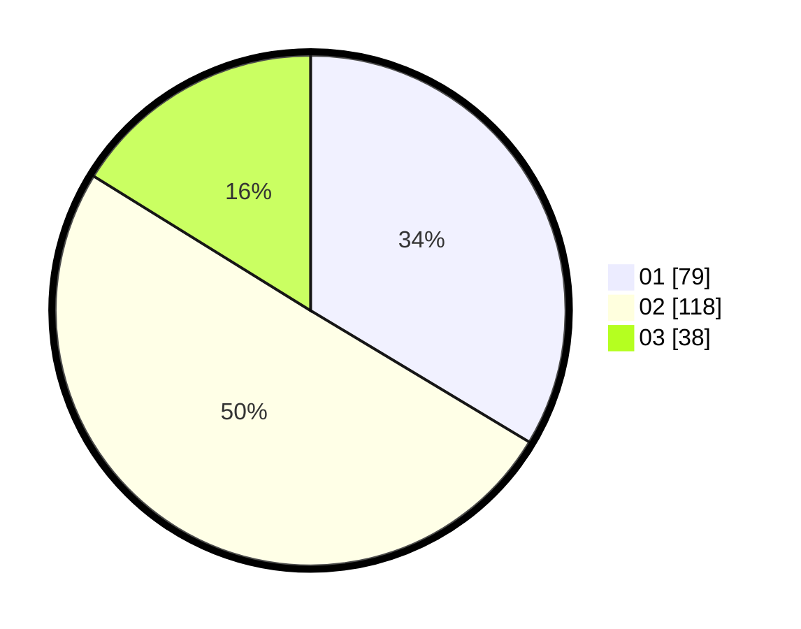

# Hasil

Hasil perolehan suara paslon dapat dilihat pada file paslon-01.txt, paslon-02.txt, dan paslon-03.txt.

Jika tidak ada, artinya data tersebut belum ada pada SIREKAP.

## Perolehan Suara

 * Paslon 01: **79**.
 * Paslon 02: **118**.
 * Paslon 03: **38**.

## Foto C Plano

https://sirekap-obj-formc.kpu.go.id/95e1/pemilu/ppwp/31/71/03/10/01/3171031001051-20240215-152627--901df263-ebb1-40f8-8ea9-424b8bb6e5e1.jpg

https://sirekap-obj-formc.kpu.go.id/95e1/pemilu/ppwp/31/71/03/10/01/3171031001051-20240215-152754--29780f4a-8f93-42ba-958e-915fea5dd482.jpg

https://sirekap-obj-formc.kpu.go.id/95e1/pemilu/ppwp/31/71/03/10/01/3171031001051-20240215-152953--f3e01dd5-8d20-40f7-9320-16e62d28b365.jpg

## DATA PEMILIH TETAP

Jumlah pemilih dalam DPT: **293**.
 * L: **151**.
 * P: **142**.

## DATA PENGGUNA HAK PILIH

Jumlah pengguna hak pilih dalam DPT: **236**.
 * L: **122**.
 * P: **114**.

Jumlah pengguna hak pilih dalam DPTb: **4**.
 * L: **1**.
 * P: **3**.

Jumlah pengguna hak pilih dalam DPK: **1**.
 * L: **1**.
 * P: **0**.

Jumlah pengguna hak pilih: **241**.
 * L: **124**.
 * P: **117**.

## JUMLAH SUARA SAH DAN TIDAK SAH

JUMLAH SELURUH SUARA SAH: **235**.

JUMLAH SUARA TIDAK SAH: **6**.

JUMLAH SELURUH SUARA SAH DAN SUARA TIDAK SAH: **241**.
