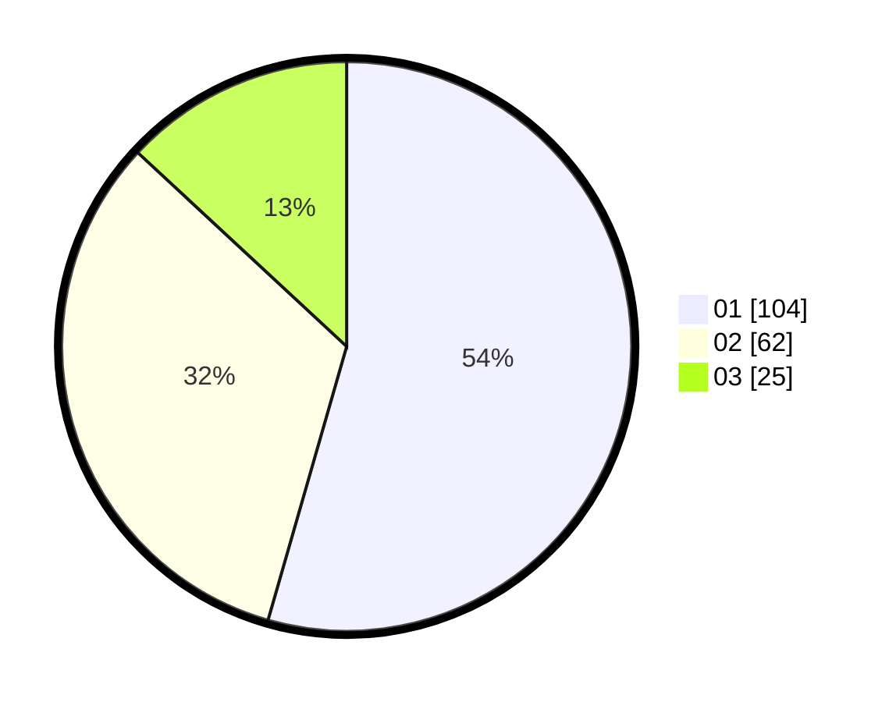

# Hasil

Hasil perolehan suara paslon dapat dilihat pada file paslon-01.txt, paslon-02.txt, dan paslon-03.txt.

Jika tidak ada, artinya data tersebut belum ada pada SIREKAP.

## Perolehan Suara

 * Paslon 01: **104**.
 * Paslon 02: **62**.
 * Paslon 03: **25**.

## Foto C Plano

https://sirekap-obj-formc.kpu.go.id/7b09/pemilu/ppwp/31/71/03/10/01/3171031001054-20240214-233126--4dd26217-cf9c-4e7e-b9cf-6e0f887925ee.jpg

https://sirekap-obj-formc.kpu.go.id/7b09/pemilu/ppwp/31/71/03/10/01/3171031001054-20240214-184650--b4371b31-ab27-4e78-ab71-38b30fb7ef26.jpg

https://sirekap-obj-formc.kpu.go.id/7b09/pemilu/ppwp/31/71/03/10/01/3171031001054-20240214-185054--8c2098c8-d9d6-4f15-b7ad-3d47c45bf990.jpg

## DATA PEMILIH TETAP

Jumlah pemilih dalam DPT: **268**.
 * L: **136**.
 * P: **132**.

## DATA PENGGUNA HAK PILIH

Jumlah pengguna hak pilih dalam DPT: **192**.
 * L: **98**.
 * P: **94**.

Jumlah pengguna hak pilih dalam DPTb: **1**.
 * L: **0**.
 * P: **1**.

Jumlah pengguna hak pilih dalam DPK: **1**.
 * L: **0**.
 * P: **1**.

Jumlah pengguna hak pilih: **194**.
 * L: **98**.
 * P: **96**.

## JUMLAH SUARA SAH DAN TIDAK SAH

JUMLAH SELURUH SUARA SAH: **191**.

JUMLAH SUARA TIDAK SAH: **3**.

JUMLAH SELURUH SUARA SAH DAN SUARA TIDAK SAH: **194**.
