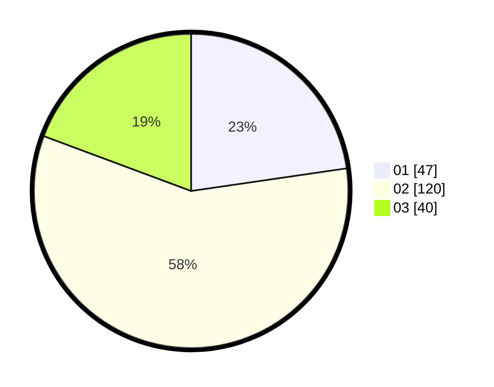

# Hasil

Hasil perolehan suara paslon dapat dilihat pada file paslon-01.txt, paslon-02.txt, dan paslon-03.txt.

Jika tidak ada, artinya data tersebut belum ada pada SIREKAP.

## Perolehan Suara

 * Paslon 01: **47**.
 * Paslon 02: **120**.
 * Paslon 03: **40**.

## Foto C Plano

https://sirekap-obj-formc.kpu.go.id/2a96/pemilu/ppwp/31/71/03/10/01/3171031001062-20240217-180048--4c19650b-0892-4edd-a228-cb5e28898e89.jpg

https://sirekap-obj-formc.kpu.go.id/2a96/pemilu/ppwp/31/71/03/10/01/3171031001062-20240217-180049--343e32fc-fbf2-4132-b66c-e6efd2e51cd1.jpg

https://sirekap-obj-formc.kpu.go.id/2a96/pemilu/ppwp/31/71/03/10/01/3171031001062-20240217-180049--61449abd-1148-4a4b-8808-1791567b16f4.jpg

## DATA PEMILIH TETAP

Jumlah pemilih dalam DPT: **285**.
 * L: **126**.
 * P: **159**.

## DATA PENGGUNA HAK PILIH

Jumlah pengguna hak pilih dalam DPT: **201**.
 * L: **82**.
 * P: **119**.

Jumlah pengguna hak pilih dalam DPTb: **2**.
 * L: **0**.
 * P: **2**.

Jumlah pengguna hak pilih dalam DPK: **6**.
 * L: **2**.
 * P: **4**.

Jumlah pengguna hak pilih: **209**.
 * L: **84**.
 * P: **125**.

## JUMLAH SUARA SAH DAN TIDAK SAH

JUMLAH SELURUH SUARA SAH: **207**.

JUMLAH SUARA TIDAK SAH: **2**.

JUMLAH SELURUH SUARA SAH DAN SUARA TIDAK SAH: **209**.
