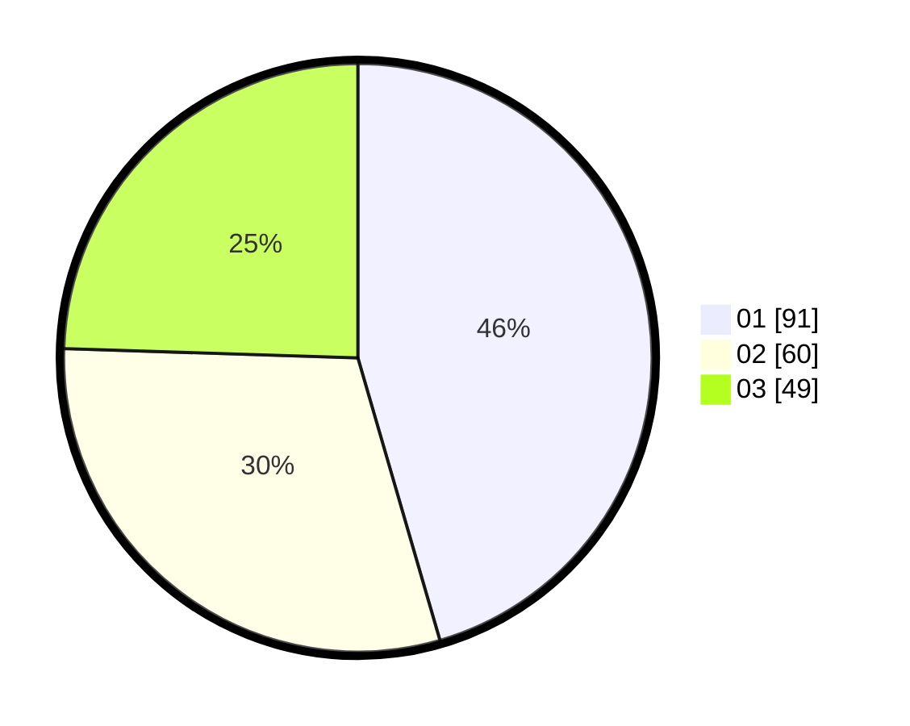

# Hasil

Hasil perolehan suara paslon dapat dilihat pada file paslon-01.txt, paslon-02.txt, dan paslon-03.txt.

Jika tidak ada, artinya data tersebut belum ada pada SIREKAP.

## Perolehan Suara

 * Paslon 01: **91**.
 * Paslon 02: **60**.
 * Paslon 03: **49**.

## Foto C Plano

https://sirekap-obj-formc.kpu.go.id/8790/pemilu/ppwp/31/71/03/10/01/3171031001064-20240216-172033--e808778b-e8df-43b4-8c9a-d45228e49960.jpg

https://sirekap-obj-formc.kpu.go.id/8790/pemilu/ppwp/31/71/03/10/01/3171031001064-20240216-172034--88a051aa-5ec1-4252-83ba-f6278c5b973c.jpg

https://sirekap-obj-formc.kpu.go.id/8790/pemilu/ppwp/31/71/03/10/01/3171031001064-20240216-172033--665bdc05-f8ff-4fb4-a751-c67135d242f5.jpg

## DATA PEMILIH TETAP

Jumlah pemilih dalam DPT: **295**.
 * L: **157**.
 * P: **138**.

## DATA PENGGUNA HAK PILIH

Jumlah pengguna hak pilih dalam DPT: **206**.
 * L: **100**.
 * P: **106**.

Jumlah pengguna hak pilih dalam DPTb: **0**.
 * L: **0**.
 * P: **0**.

Jumlah pengguna hak pilih dalam DPK: **0**.
 * L: **0**.
 * P: **0**.

Jumlah pengguna hak pilih: **206**.
 * L: **100**.
 * P: **106**.

## JUMLAH SUARA SAH DAN TIDAK SAH

JUMLAH SELURUH SUARA SAH: **200**.

JUMLAH SUARA TIDAK SAH: **6**.

JUMLAH SELURUH SUARA SAH DAN SUARA TIDAK SAH: **206**.
