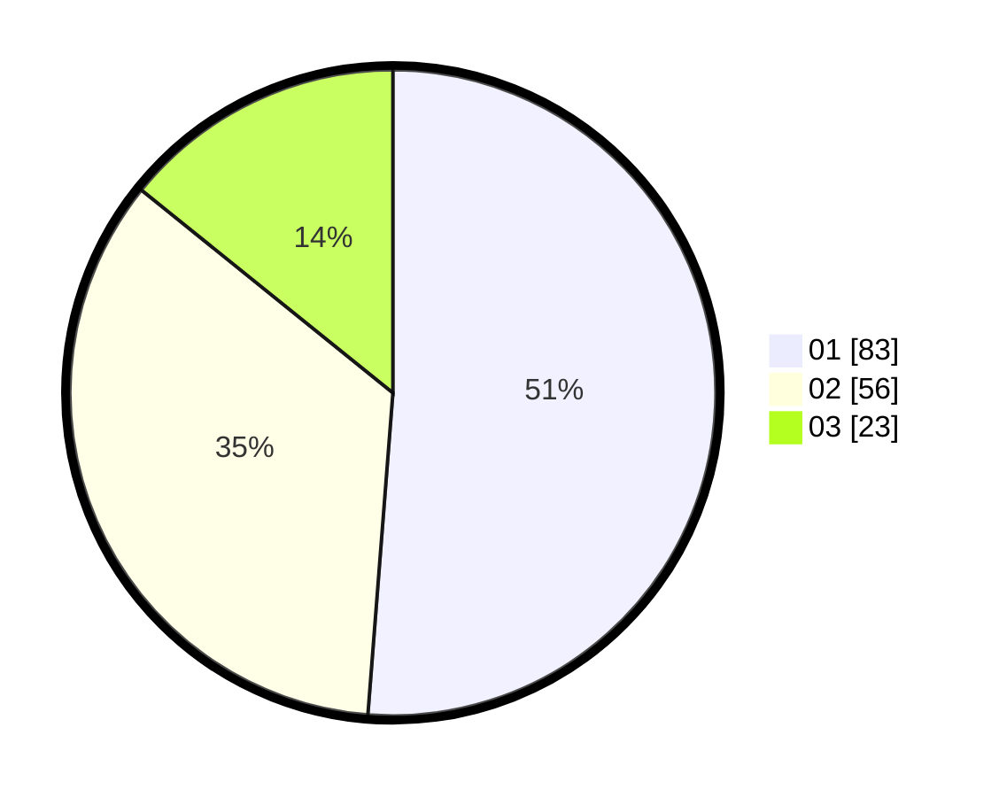

# Hasil

Hasil perolehan suara paslon dapat dilihat pada file paslon-01.txt, paslon-02.txt, dan paslon-03.txt.

Jika tidak ada, artinya data tersebut belum ada pada SIREKAP.

## Perolehan Suara

 * Paslon 01: **83**.
 * Paslon 02: **56**.
 * Paslon 03: **23**.

## Foto C Plano

https://sirekap-obj-formc.kpu.go.id/10d8/pemilu/ppwp/31/71/03/10/01/3171031001070-20240217-102136--c57cbff3-09d9-4cd9-ac4e-58ca54a3d457.jpg

https://sirekap-obj-formc.kpu.go.id/10d8/pemilu/ppwp/31/71/03/10/01/3171031001070-20240217-102138--ea1e4bd7-59f0-4623-a468-1f6a6c4174d4.jpg

https://sirekap-obj-formc.kpu.go.id/10d8/pemilu/ppwp/31/71/03/10/01/3171031001070-20240217-102137--d779a1a9-06ea-4291-8038-8d0dfc4e9d8e.jpg

## DATA PEMILIH TETAP

Jumlah pemilih dalam DPT: **245**.
 * L: **121**.
 * P: **124**.

## DATA PENGGUNA HAK PILIH

Jumlah pengguna hak pilih dalam DPT: **165**.
 * L: **74**.
 * P: **91**.

Jumlah pengguna hak pilih dalam DPTb: **1**.
 * L: **1**.
 * P: **0**.

Jumlah pengguna hak pilih dalam DPK: **0**.
 * L: **0**.
 * P: **0**.

Jumlah pengguna hak pilih: **166**.
 * L: **75**.
 * P: **91**.

## JUMLAH SUARA SAH DAN TIDAK SAH

JUMLAH SELURUH SUARA SAH: **162**.

JUMLAH SUARA TIDAK SAH: **4**.

JUMLAH SELURUH SUARA SAH DAN SUARA TIDAK SAH: **166**.
