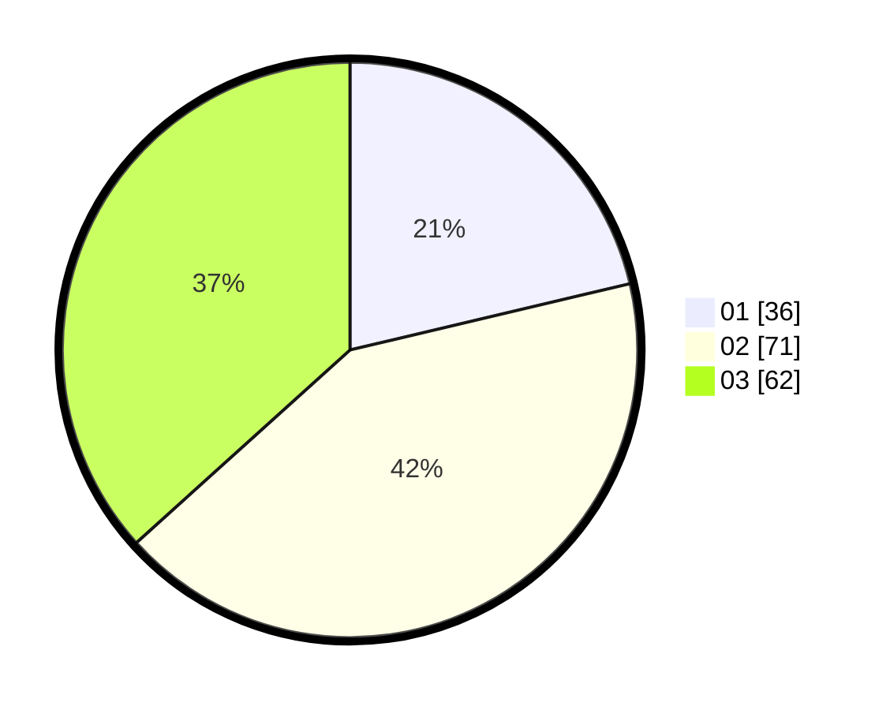

# Hasil

Hasil perolehan suara paslon dapat dilihat pada file paslon-01.txt, paslon-02.txt, dan paslon-03.txt.

Jika tidak ada, artinya data tersebut belum ada pada SIREKAP.

## Perolehan Suara

 * Paslon 01: **36**.
 * Paslon 02: **71**.
 * Paslon 03: **62**.

## Foto C Plano

https://sirekap-obj-formc.kpu.go.id/6f76/pemilu/ppwp/31/71/03/10/01/3171031001071-20240215-012135--2b4a762c-90b0-4a61-96b4-a38a62278838.jpg

https://sirekap-obj-formc.kpu.go.id/6f76/pemilu/ppwp/31/71/03/10/01/3171031001071-20240215-012305--c79de90b-6840-45c1-90bc-0bdad5f337f3.jpg

https://sirekap-obj-formc.kpu.go.id/6f76/pemilu/ppwp/31/71/03/10/01/3171031001071-20240215-012555--b0dcbf39-a193-4c88-a4f3-8f0d835e860e.jpg

## DATA PEMILIH TETAP

Jumlah pemilih dalam DPT: **238**.
 * L: **119**.
 * P: **119**.

## DATA PENGGUNA HAK PILIH

Jumlah pengguna hak pilih dalam DPT: **167**.
 * L: **80**.
 * P: **87**.

Jumlah pengguna hak pilih dalam DPTb: **1**.
 * L: **0**.
 * P: **1**.

Jumlah pengguna hak pilih dalam DPK: **2**.
 * L: **1**.
 * P: **1**.

Jumlah pengguna hak pilih: **170**.
 * L: **81**.
 * P: **89**.

## JUMLAH SUARA SAH DAN TIDAK SAH

JUMLAH SELURUH SUARA SAH: **169**.

JUMLAH SUARA TIDAK SAH: **1**.

JUMLAH SELURUH SUARA SAH DAN SUARA TIDAK SAH: **170**.
