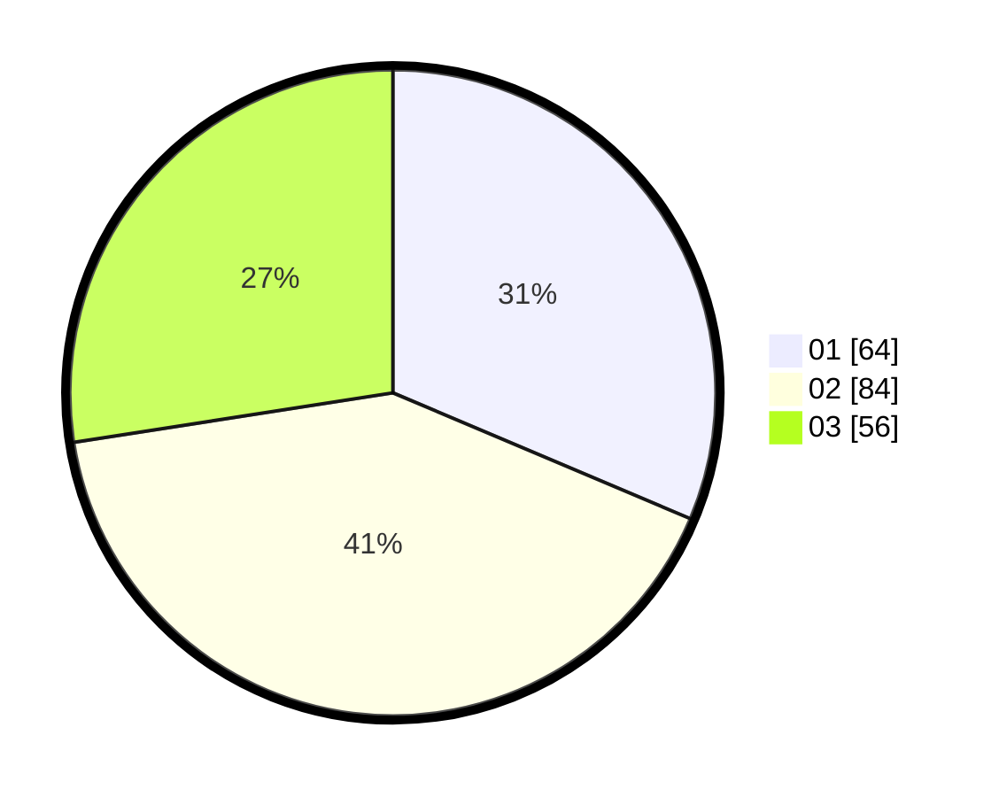

# Hasil

Hasil perolehan suara paslon dapat dilihat pada file paslon-01.txt, paslon-02.txt, dan paslon-03.txt.

Jika tidak ada, artinya data tersebut belum ada pada SIREKAP.

## Perolehan Suara

 * Paslon 01: **64**.
 * Paslon 02: **84**.
 * Paslon 03: **56**.

## Foto C Plano

https://sirekap-obj-formc.kpu.go.id/dfe0/pemilu/ppwp/31/71/03/10/02/3171031002007-20240215-132959--7e5715e7-5839-4704-b8e4-b3954f770832.jpg

https://sirekap-obj-formc.kpu.go.id/dfe0/pemilu/ppwp/31/71/03/10/02/3171031002007-20240215-133021--a1d85b90-0f59-4a9f-99ec-781820e65057.jpg

https://sirekap-obj-formc.kpu.go.id/dfe0/pemilu/ppwp/31/71/03/10/02/3171031002007-20240215-133010--db838236-c53a-420c-98e2-946947cfbcc0.jpg

## DATA PEMILIH TETAP

Jumlah pemilih dalam DPT: **277**.
 * L: **134**.
 * P: **143**.

## DATA PENGGUNA HAK PILIH

Jumlah pengguna hak pilih dalam DPT: **204**.
 * L: **96**.
 * P: **108**.

Jumlah pengguna hak pilih dalam DPTb: **2**.
 * L: **2**.
 * P: **0**.

Jumlah pengguna hak pilih dalam DPK: **0**.
 * L: **0**.
 * P: **0**.

Jumlah pengguna hak pilih: **206**.
 * L: **98**.
 * P: **108**.

## JUMLAH SUARA SAH DAN TIDAK SAH

JUMLAH SELURUH SUARA SAH: **204**.

JUMLAH SUARA TIDAK SAH: **2**.

JUMLAH SELURUH SUARA SAH DAN SUARA TIDAK SAH: **206**.
