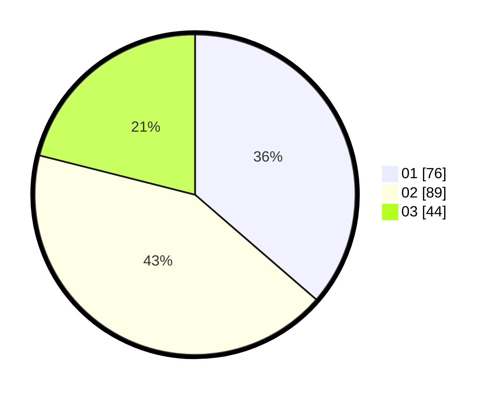

# Hasil

Hasil perolehan suara paslon dapat dilihat pada file paslon-01.txt, paslon-02.txt, dan paslon-03.txt.

Jika tidak ada, artinya data tersebut belum ada pada SIREKAP.

## Perolehan Suara

 * Paslon 01: **76**.
 * Paslon 02: **89**.
 * Paslon 03: **44**.

## Foto C Plano

https://sirekap-obj-formc.kpu.go.id/b5a2/pemilu/ppwp/31/71/03/10/02/3171031002009-20240216-155103--c95954c3-8fd3-4e62-9f1d-8cd5d6009fde.jpg

https://sirekap-obj-formc.kpu.go.id/b5a2/pemilu/ppwp/31/71/03/10/02/3171031002009-20240216-155104--7196e2d7-9e6b-43f5-a48d-54c3945c94ae.jpg

https://sirekap-obj-formc.kpu.go.id/b5a2/pemilu/ppwp/31/71/03/10/02/3171031002009-20240216-155103--61e940ff-e577-4279-b69d-a81d210af68b.jpg

## DATA PEMILIH TETAP

Jumlah pemilih dalam DPT: **277**.
 * L: **145**.
 * P: **132**.

## DATA PENGGUNA HAK PILIH

Jumlah pengguna hak pilih dalam DPT: **206**.
 * L: **105**.
 * P: **101**.

Jumlah pengguna hak pilih dalam DPTb: **0**.
 * L: **0**.
 * P: **0**.

Jumlah pengguna hak pilih dalam DPK: **5**.
 * L: **2**.
 * P: **3**.

Jumlah pengguna hak pilih: **211**.
 * L: **107**.
 * P: **104**.

## JUMLAH SUARA SAH DAN TIDAK SAH

JUMLAH SELURUH SUARA SAH: **209**.

JUMLAH SUARA TIDAK SAH: **2**.

JUMLAH SELURUH SUARA SAH DAN SUARA TIDAK SAH: **211**.
