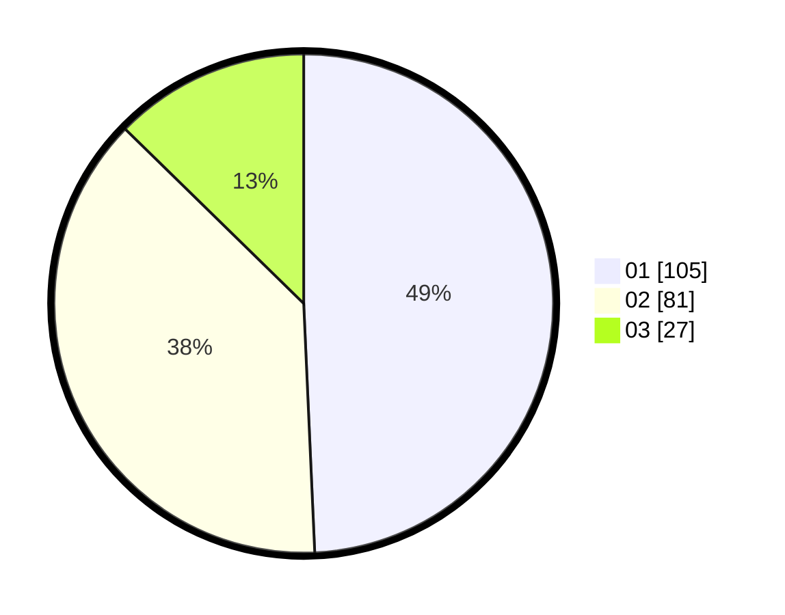

# Hasil

Hasil perolehan suara paslon dapat dilihat pada file paslon-01.txt, paslon-02.txt, dan paslon-03.txt.

Jika tidak ada, artinya data tersebut belum ada pada SIREKAP.

## Perolehan Suara

 * Paslon 01: **105**.
 * Paslon 02: **81**.
 * Paslon 03: **27**.

## Foto C Plano

https://sirekap-obj-formc.kpu.go.id/081f/pemilu/ppwp/31/71/03/10/02/3171031002011-20240216-145455--6d641958-fb83-44c6-b9a7-bc64ae26dacd.jpg

https://sirekap-obj-formc.kpu.go.id/081f/pemilu/ppwp/31/71/03/10/02/3171031002011-20240216-115918--08320fc5-b2a4-4c0c-a777-85cf5626b11f.jpg

https://sirekap-obj-formc.kpu.go.id/081f/pemilu/ppwp/31/71/03/10/02/3171031002011-20240216-145456--8f3f3dba-ceb4-448b-a3d4-2e55bba6700a.jpg

## DATA PEMILIH TETAP

Jumlah pemilih dalam DPT: **215**.
 * L: **99**.
 * P: **116**.

## DATA PENGGUNA HAK PILIH

Jumlah pengguna hak pilih dalam DPT: **212**.
 * L: **98**.
 * P: **114**.

Jumlah pengguna hak pilih dalam DPTb: **3**.
 * L: **1**.
 * P: **2**.

Jumlah pengguna hak pilih dalam DPK: **0**.
 * L: **0**.
 * P: **0**.

Jumlah pengguna hak pilih: **215**.
 * L: **99**.
 * P: **116**.

## JUMLAH SUARA SAH DAN TIDAK SAH

JUMLAH SELURUH SUARA SAH: **213**.

JUMLAH SUARA TIDAK SAH: **2**.

JUMLAH SELURUH SUARA SAH DAN SUARA TIDAK SAH: **215**.
