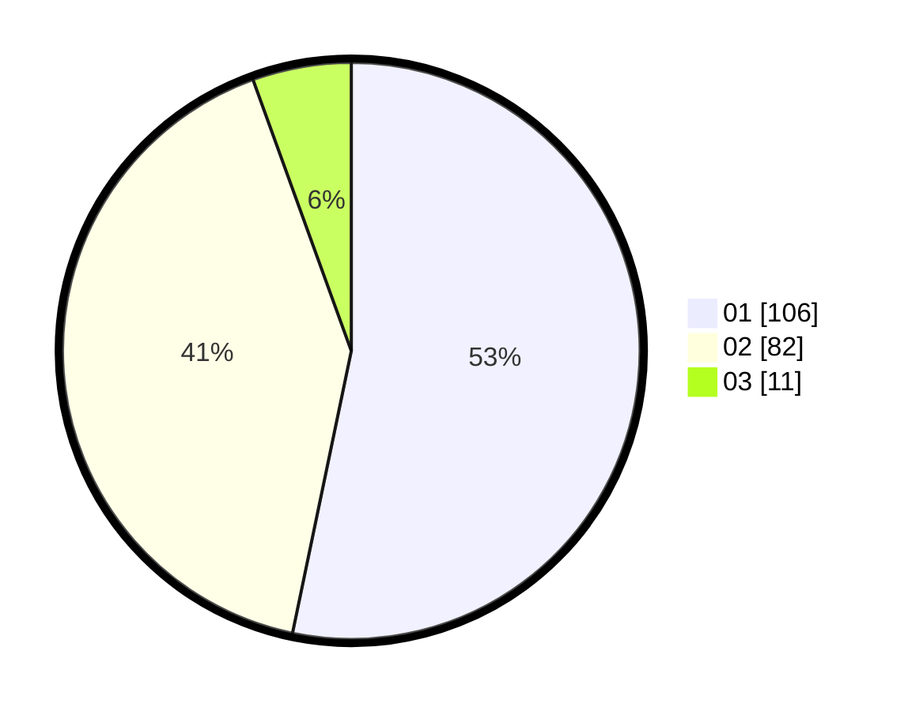

# Hasil

Hasil perolehan suara paslon dapat dilihat pada file paslon-01.txt, paslon-02.txt, dan paslon-03.txt.

Jika tidak ada, artinya data tersebut belum ada pada SIREKAP.

## Perolehan Suara

 * Paslon 01: **106**.
 * Paslon 02: **82**.
 * Paslon 03: **11**.

## Foto C Plano

https://sirekap-obj-formc.kpu.go.id/b877/pemilu/ppwp/31/71/03/10/02/3171031002012-20240216-150844--79637b51-221c-419b-8a48-2e7d1f0f98d0.jpg

https://sirekap-obj-formc.kpu.go.id/b877/pemilu/ppwp/31/71/03/10/02/3171031002012-20240216-150846--7f707f4b-626e-453a-bb92-4d13d8e9a9a7.jpg

https://sirekap-obj-formc.kpu.go.id/b877/pemilu/ppwp/31/71/03/10/02/3171031002012-20240216-150845--7a02263a-d6ba-401a-abda-323f0688b84c.jpg

## DATA PEMILIH TETAP

Jumlah pemilih dalam DPT: **275**.
 * L: **140**.
 * P: **135**.

## DATA PENGGUNA HAK PILIH

Jumlah pengguna hak pilih dalam DPT: **199**.
 * L: **103**.
 * P: **96**.

Jumlah pengguna hak pilih dalam DPTb: **0**.
 * L: **0**.
 * P: **0**.

Jumlah pengguna hak pilih dalam DPK: **2**.
 * L: **1**.
 * P: **1**.

Jumlah pengguna hak pilih: **201**.
 * L: **104**.
 * P: **97**.

## JUMLAH SUARA SAH DAN TIDAK SAH

JUMLAH SELURUH SUARA SAH: **199**.

JUMLAH SUARA TIDAK SAH: **2**.

JUMLAH SELURUH SUARA SAH DAN SUARA TIDAK SAH: **201**.
