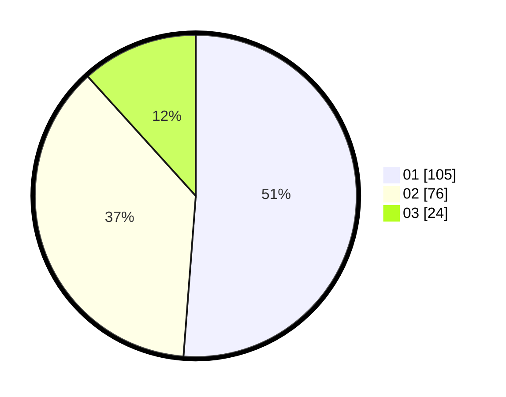

# Hasil

Hasil perolehan suara paslon dapat dilihat pada file paslon-01.txt, paslon-02.txt, dan paslon-03.txt.

Jika tidak ada, artinya data tersebut belum ada pada SIREKAP.

## Perolehan Suara

 * Paslon 01: **105**.
 * Paslon 02: **76**.
 * Paslon 03: **24**.

## Foto C Plano

https://sirekap-obj-formc.kpu.go.id/e88a/pemilu/ppwp/31/71/03/10/02/3171031002014-20240214-215508--fb02ac31-0527-4b2a-bc6b-cca8954174c8.jpg

https://sirekap-obj-formc.kpu.go.id/e88a/pemilu/ppwp/31/71/03/10/02/3171031002014-20240214-215022--6e357901-540a-422b-b0d7-8153bd425c07.jpg

https://sirekap-obj-formc.kpu.go.id/e88a/pemilu/ppwp/31/71/03/10/02/3171031002014-20240216-144751--fef2a0f0-6343-449d-89a4-007b6c15a726.jpg

## DATA PEMILIH TETAP

Jumlah pemilih dalam DPT: **272**.
 * L: **137**.
 * P: **175**.

## DATA PENGGUNA HAK PILIH

Jumlah pengguna hak pilih dalam DPT: **202**.
 * L: **101**.
 * P: **101**.

Jumlah pengguna hak pilih dalam DPTb: **2**.
 * L: **1**.
 * P: **1**.

Jumlah pengguna hak pilih dalam DPK: **4**.
 * L: **1**.
 * P: **2**.

Jumlah pengguna hak pilih: **208**.
 * L: **103**.
 * P: **105**.

## JUMLAH SUARA SAH DAN TIDAK SAH

JUMLAH SELURUH SUARA SAH: **205**.

JUMLAH SUARA TIDAK SAH: **3**.

JUMLAH SELURUH SUARA SAH DAN SUARA TIDAK SAH: **208**.
