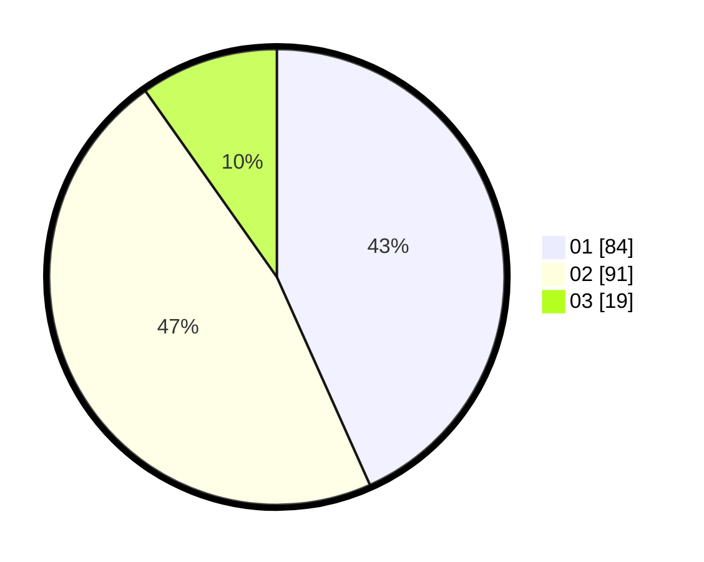

# Hasil

Hasil perolehan suara paslon dapat dilihat pada file paslon-01.txt, paslon-02.txt, dan paslon-03.txt.

Jika tidak ada, artinya data tersebut belum ada pada SIREKAP.

## Perolehan Suara

 * Paslon 01: **84**.
 * Paslon 02: **91**.
 * Paslon 03: **19**.

## Foto C Plano

https://sirekap-obj-formc.kpu.go.id/d803/pemilu/ppwp/31/71/03/10/02/3171031002019-20240214-203130--0fd63df3-481c-4c65-9afa-d16b3fbff673.jpg

https://sirekap-obj-formc.kpu.go.id/d803/pemilu/ppwp/31/71/03/10/02/3171031002019-20240214-200522--2d402d21-19fe-4d19-9098-e232b1eaf321.jpg

https://sirekap-obj-formc.kpu.go.id/d803/pemilu/ppwp/31/71/03/10/02/3171031002019-20240216-141253--92a77238-c0d6-4a02-9b80-5d7ce0fb9d34.jpg

## DATA PEMILIH TETAP

Jumlah pemilih dalam DPT: **185**.
 * L: **91**.
 * P: **94**.

## DATA PENGGUNA HAK PILIH

Jumlah pengguna hak pilih dalam DPT: **281**.
 * L: **139**.
 * P: **142**.

Jumlah pengguna hak pilih dalam DPTb: **14**.
 * L: **11**.
 * P: **3**.

Jumlah pengguna hak pilih dalam DPK: **1**.
 * L: **0**.
 * P: **1**.

Jumlah pengguna hak pilih: **296**.
 * L: **150**.
 * P: **146**.

## JUMLAH SUARA SAH DAN TIDAK SAH

JUMLAH SELURUH SUARA SAH: **194**.

JUMLAH SUARA TIDAK SAH: **4**.

JUMLAH SELURUH SUARA SAH DAN SUARA TIDAK SAH: **198**.
