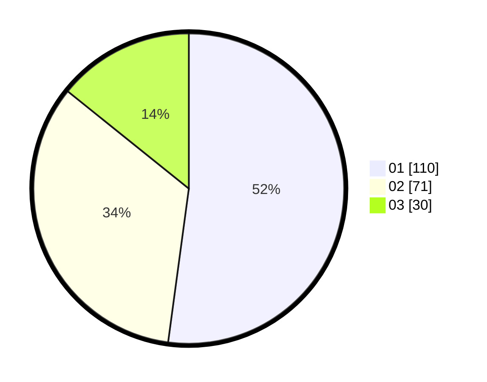

# Hasil

Hasil perolehan suara paslon dapat dilihat pada file paslon-01.txt, paslon-02.txt, dan paslon-03.txt.

Jika tidak ada, artinya data tersebut belum ada pada SIREKAP.

## Perolehan Suara

 * Paslon 01: **110**.
 * Paslon 02: **71**.
 * Paslon 03: **30**.

## Foto C Plano

https://sirekap-obj-formc.kpu.go.id/333e/pemilu/ppwp/31/71/03/10/02/3171031002021-20240217-113831--736fbe22-abeb-420f-81e0-2b759e42e750.jpg

https://sirekap-obj-formc.kpu.go.id/333e/pemilu/ppwp/31/71/03/10/02/3171031002021-20240217-113648--736ae80b-52dc-4f9b-b140-ef042f1c71da.jpg

https://sirekap-obj-formc.kpu.go.id/333e/pemilu/ppwp/31/71/03/10/02/3171031002021-20240217-113032--c6305233-1798-4977-82cf-d0b317763280.jpg
