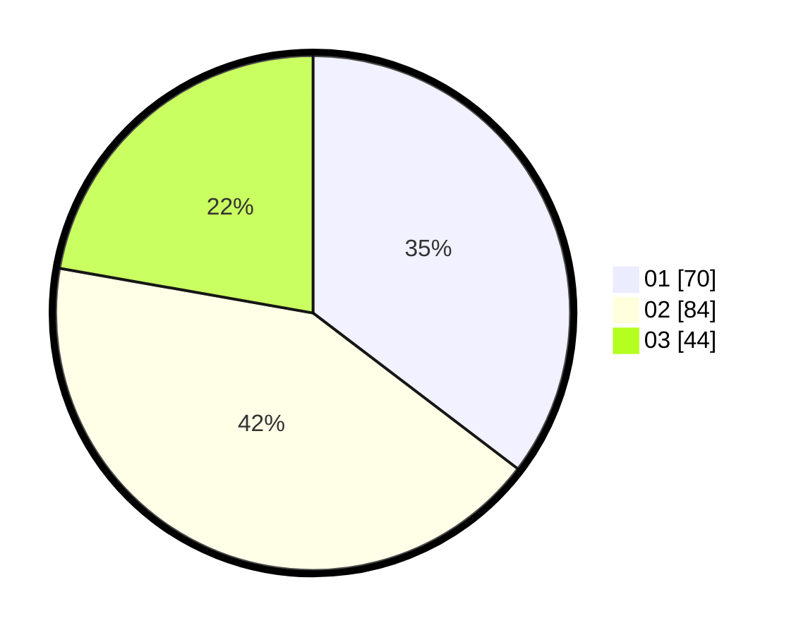

# Hasil

Hasil perolehan suara paslon dapat dilihat pada file paslon-01.txt, paslon-02.txt, dan paslon-03.txt.

Jika tidak ada, artinya data tersebut belum ada pada SIREKAP.

## Perolehan Suara

 * Paslon 01: **70**.
 * Paslon 02: **84**.
 * Paslon 03: **44**.

## Foto C Plano

https://sirekap-obj-formc.kpu.go.id/d7e5/pemilu/ppwp/31/71/03/10/02/3171031002024-20240215-045329--4a7353e2-9dbf-42b0-b56f-dd73afd8f3c2.jpg

https://sirekap-obj-formc.kpu.go.id/d7e5/pemilu/ppwp/31/71/03/10/02/3171031002024-20240215-045911--a058836b-baf3-4b82-ac67-0d6dc539ea2c.jpg

https://sirekap-obj-formc.kpu.go.id/d7e5/pemilu/ppwp/31/71/03/10/02/3171031002024-20240215-050752--b0011ca0-3f4f-45c9-80d9-d8e6d3b4350a.jpg

## DATA PEMILIH TETAP

Jumlah pemilih dalam DPT: **293**.
 * L: **148**.
 * P: **145**.

## DATA PENGGUNA HAK PILIH

Jumlah pengguna hak pilih dalam DPT: **199**.
 * L: **92**.
 * P: **107**.

Jumlah pengguna hak pilih dalam DPTb: **0**.
 * L: **0**.
 * P: **0**.

Jumlah pengguna hak pilih dalam DPK: **0**.
 * L: **0**.
 * P: **0**.

Jumlah pengguna hak pilih: **199**.
 * L: **92**.
 * P: **107**.

## JUMLAH SUARA SAH DAN TIDAK SAH

JUMLAH SELURUH SUARA SAH: **198**.

JUMLAH SUARA TIDAK SAH: **1**.

JUMLAH SELURUH SUARA SAH DAN SUARA TIDAK SAH: **199**.
