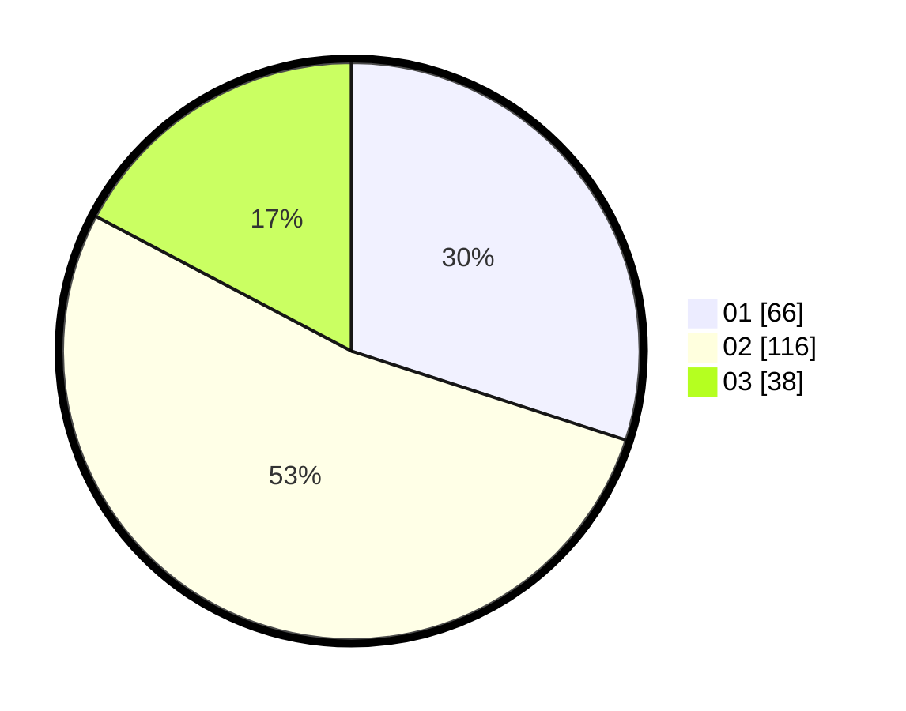

# Hasil

Hasil perolehan suara paslon dapat dilihat pada file paslon-01.txt, paslon-02.txt, dan paslon-03.txt.

Jika tidak ada, artinya data tersebut belum ada pada SIREKAP.

## Perolehan Suara

 * Paslon 01: **66**.
 * Paslon 02: **116**.
 * Paslon 03: **38**.

## Foto C Plano

https://sirekap-obj-formc.kpu.go.id/0c51/pemilu/ppwp/31/71/03/10/02/3171031002028-20240215-234041--70487fc4-8649-4cbe-ada4-1745fabb6d48.jpg

https://sirekap-obj-formc.kpu.go.id/0c51/pemilu/ppwp/31/71/03/10/02/3171031002028-20240215-234045--30a5bdac-58bc-48a3-850f-ab48050b77f3.jpg

https://sirekap-obj-formc.kpu.go.id/0c51/pemilu/ppwp/31/71/03/10/02/3171031002028-20240215-234042--7b195011-7868-4653-8cdb-6d31f8524f2a.jpg

## DATA PEMILIH TETAP

Jumlah pemilih dalam DPT: **288**.
 * L: **143**.
 * P: **145**.

## DATA PENGGUNA HAK PILIH

Jumlah pengguna hak pilih dalam DPT: **218**.
 * L: **103**.
 * P: **115**.

Jumlah pengguna hak pilih dalam DPTb: **0**.
 * L: **0**.
 * P: **0**.

Jumlah pengguna hak pilih dalam DPK: **4**.
 * L: **1**.
 * P: **3**.

Jumlah pengguna hak pilih: **222**.
 * L: **104**.
 * P: **118**.

## JUMLAH SUARA SAH DAN TIDAK SAH

JUMLAH SELURUH SUARA SAH: **220**.

JUMLAH SUARA TIDAK SAH: **2**.

JUMLAH SELURUH SUARA SAH DAN SUARA TIDAK SAH: **222**.
