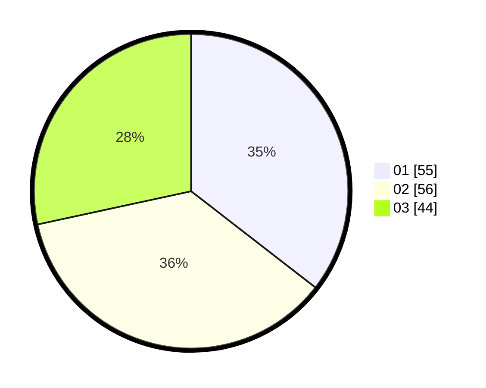

# Hasil

Hasil perolehan suara paslon dapat dilihat pada file paslon-01.txt, paslon-02.txt, dan paslon-03.txt.

Jika tidak ada, artinya data tersebut belum ada pada SIREKAP.

## Perolehan Suara

 * Paslon 01: **55**.
 * Paslon 02: **56**.
 * Paslon 03: **44**.

## Foto C Plano

https://sirekap-obj-formc.kpu.go.id/88b0/pemilu/ppwp/31/71/03/10/02/3171031002034-20240216-144707--dfcb54b6-f90a-4347-a9fe-d61a53e42639.jpg

https://sirekap-obj-formc.kpu.go.id/88b0/pemilu/ppwp/31/71/03/10/02/3171031002034-20240216-144708--220797b1-5ed3-4b38-863f-96c757f29584.jpg

https://sirekap-obj-formc.kpu.go.id/88b0/pemilu/ppwp/31/71/03/10/02/3171031002034-20240216-144708--a6762008-a651-4fcb-93ca-15e7c4824f5a.jpg

## DATA PEMILIH TETAP

Jumlah pemilih dalam DPT: **220**.
 * L: **121**.
 * P: **99**.

## DATA PENGGUNA HAK PILIH

Jumlah pengguna hak pilih dalam DPT: **161**.
 * L: **86**.
 * P: **75**.

Jumlah pengguna hak pilih dalam DPTb: **0**.
 * L: **0**.
 * P: **0**.

Jumlah pengguna hak pilih dalam DPK: **0**.
 * L: **0**.
 * P: **0**.

Jumlah pengguna hak pilih: **161**.
 * L: **86**.
 * P: **75**.

## JUMLAH SUARA SAH DAN TIDAK SAH

JUMLAH SELURUH SUARA SAH: **155**.

JUMLAH SUARA TIDAK SAH: **6**.

JUMLAH SELURUH SUARA SAH DAN SUARA TIDAK SAH: **161**.
