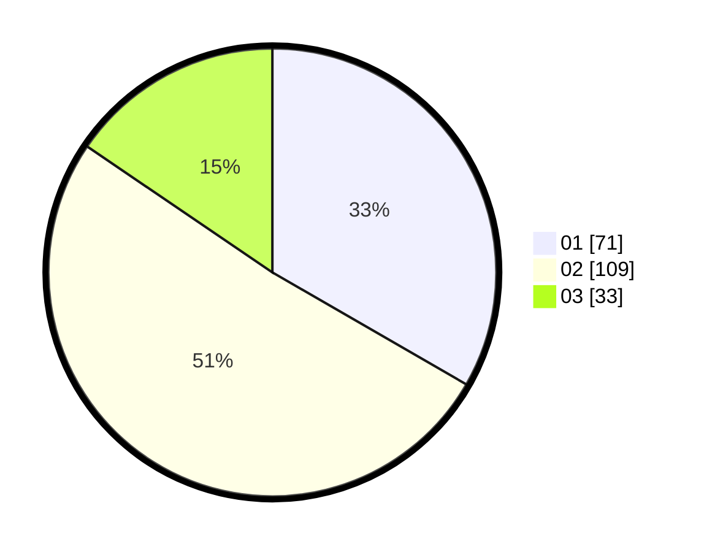

# Hasil

Hasil perolehan suara paslon dapat dilihat pada file paslon-01.txt, paslon-02.txt, dan paslon-03.txt.

Jika tidak ada, artinya data tersebut belum ada pada SIREKAP.

## Perolehan Suara

 * Paslon 01: **71**.
 * Paslon 02: **109**.
 * Paslon 03: **33**.

## Foto C Plano

https://sirekap-obj-formc.kpu.go.id/b6ac/pemilu/ppwp/31/71/03/10/02/3171031002036-20240216-131918--d1a12cec-ecd2-41b7-823e-1049b997e9a6.jpg

https://sirekap-obj-formc.kpu.go.id/b6ac/pemilu/ppwp/31/71/03/10/02/3171031002036-20240216-131919--de7f764d-cda4-4910-a861-3d1769013884.jpg

https://sirekap-obj-formc.kpu.go.id/b6ac/pemilu/ppwp/31/71/03/10/02/3171031002036-20240216-131919--d12a9bdd-3fc4-4f63-8b9a-9e9daf05b0ca.jpg

## DATA PEMILIH TETAP

Jumlah pemilih dalam DPT: **273**.
 * L: **142**.
 * P: **131**.

## DATA PENGGUNA HAK PILIH

Jumlah pengguna hak pilih dalam DPT: **213**.
 * L: **105**.
 * P: **108**.

Jumlah pengguna hak pilih dalam DPTb: **2**.
 * L: **1**.
 * P: **1**.

Jumlah pengguna hak pilih dalam DPK: **3**.
 * L: **2**.
 * P: **1**.

Jumlah pengguna hak pilih: **218**.
 * L: **108**.
 * P: **110**.

## JUMLAH SUARA SAH DAN TIDAK SAH

JUMLAH SELURUH SUARA SAH: **213**.

JUMLAH SUARA TIDAK SAH: **5**.

JUMLAH SELURUH SUARA SAH DAN SUARA TIDAK SAH: **218**.
