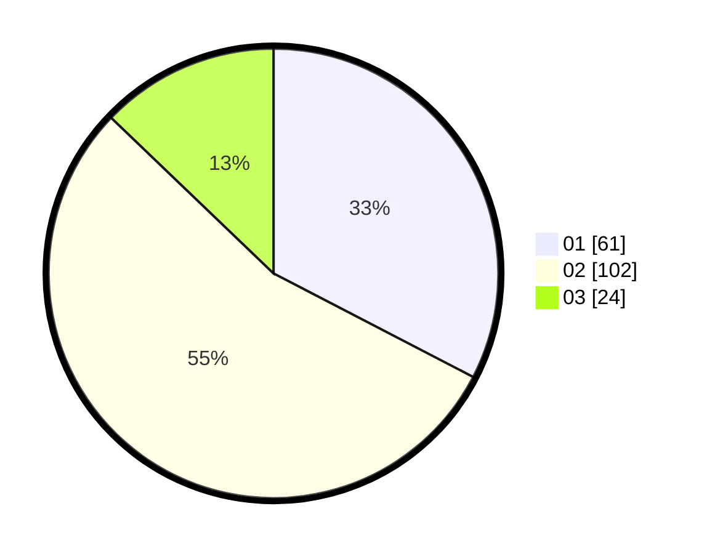

# Hasil

Hasil perolehan suara paslon dapat dilihat pada file paslon-01.txt, paslon-02.txt, dan paslon-03.txt.

Jika tidak ada, artinya data tersebut belum ada pada SIREKAP.

## Perolehan Suara

 * Paslon 01: **61**.
 * Paslon 02: **102**.
 * Paslon 03: **24**.

## Foto C Plano

https://sirekap-obj-formc.kpu.go.id/efd3/pemilu/ppwp/31/71/03/10/02/3171031002041-20240215-122628--f2f13c9f-22d4-4642-ad0a-fbf594bc865e.jpg

https://sirekap-obj-formc.kpu.go.id/efd3/pemilu/ppwp/31/71/03/10/02/3171031002041-20240215-122650--47c7bfc7-70fc-435b-80dc-51d348a9e1d5.jpg

https://sirekap-obj-formc.kpu.go.id/efd3/pemilu/ppwp/31/71/03/10/02/3171031002041-20240215-122638--64df0a96-7cd0-4a07-81f0-698f75a171b6.jpg

## DATA PEMILIH TETAP

Jumlah pemilih dalam DPT: **261**.
 * L: **132**.
 * P: **129**.

## DATA PENGGUNA HAK PILIH

Jumlah pengguna hak pilih dalam DPT: **190**.
 * L: **91**.
 * P: **99**.

Jumlah pengguna hak pilih dalam DPTb: **0**.
 * L: **0**.
 * P: **0**.

Jumlah pengguna hak pilih dalam DPK: **3**.
 * L: **1**.
 * P: **2**.

Jumlah pengguna hak pilih: **193**.
 * L: **92**.
 * P: **101**.

## JUMLAH SUARA SAH DAN TIDAK SAH

JUMLAH SELURUH SUARA SAH: **187**.

JUMLAH SUARA TIDAK SAH: **6**.

JUMLAH SELURUH SUARA SAH DAN SUARA TIDAK SAH: **193**.
