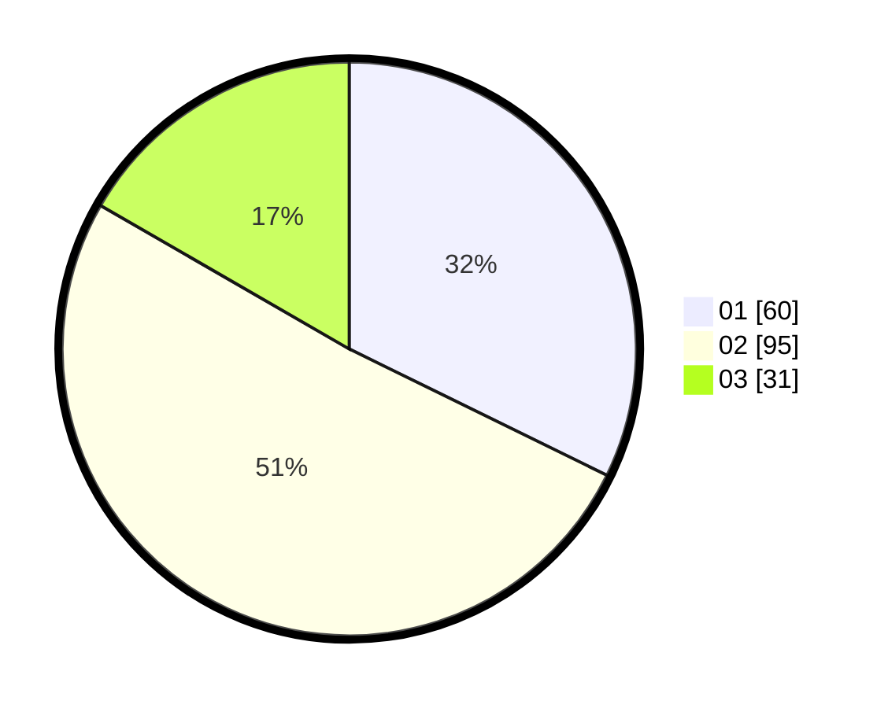

# Hasil

Hasil perolehan suara paslon dapat dilihat pada file paslon-01.txt, paslon-02.txt, dan paslon-03.txt.

Jika tidak ada, artinya data tersebut belum ada pada SIREKAP.

## Perolehan Suara

 * Paslon 01: **60**.
 * Paslon 02: **95**.
 * Paslon 03: **31**.

## Foto C Plano

https://sirekap-obj-formc.kpu.go.id/f3e3/pemilu/ppwp/31/71/03/10/02/3171031002042-20240214-225731--66c4d23f-f416-454c-80b1-0cec5dde0432.jpg

https://sirekap-obj-formc.kpu.go.id/f3e3/pemilu/ppwp/31/71/03/10/02/3171031002042-20240215-225927--3379e945-922e-486c-9a10-45f650f3fcf2.jpg

https://sirekap-obj-formc.kpu.go.id/f3e3/pemilu/ppwp/31/71/03/10/02/3171031002042-20240215-225926--efb13caa-2b82-440f-b758-0b09bf5ec9f9.jpg

## DATA PEMILIH TETAP

Jumlah pemilih dalam DPT: **188**.
 * L: **96**.
 * P: **92**.

## DATA PENGGUNA HAK PILIH

Jumlah pengguna hak pilih dalam DPT: **188**.
 * L: **96**.
 * P: **92**.

Jumlah pengguna hak pilih dalam DPTb: **0**.
 * L: **0**.
 * P: **0**.

Jumlah pengguna hak pilih dalam DPK: **3**.
 * L: **3**.
 * P: **0**.

Jumlah pengguna hak pilih: **191**.
 * L: **96**.
 * P: **92**.

## JUMLAH SUARA SAH DAN TIDAK SAH

JUMLAH SELURUH SUARA SAH: **186**.

JUMLAH SUARA TIDAK SAH: **5**.

JUMLAH SELURUH SUARA SAH DAN SUARA TIDAK SAH: **191**.
