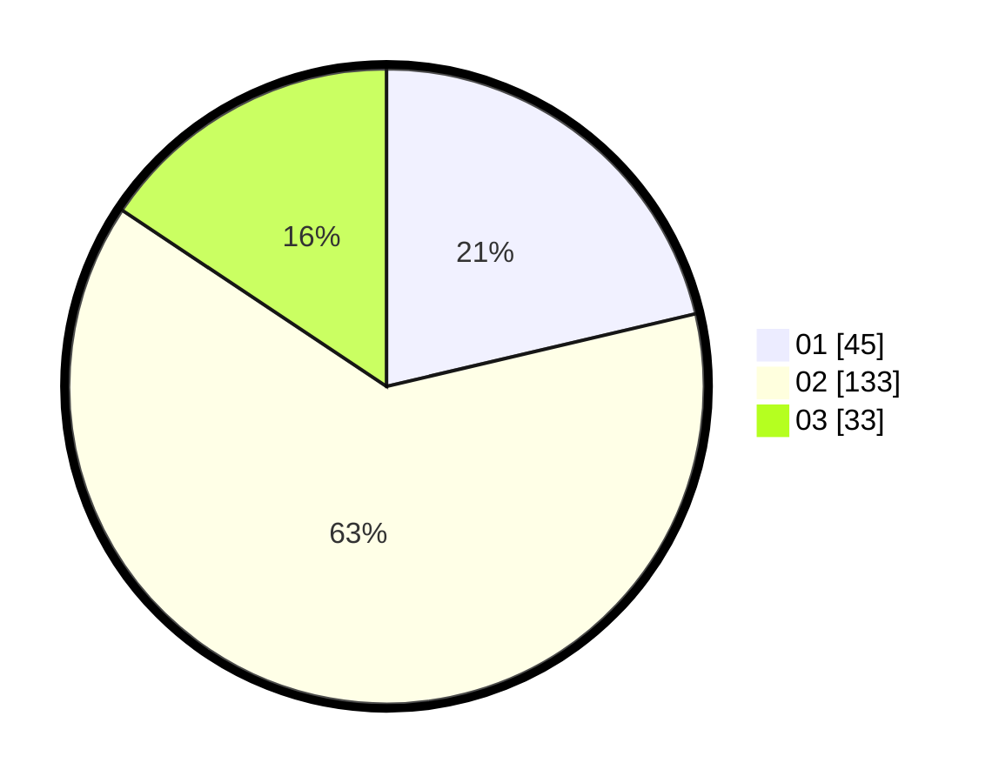

# Hasil

Hasil perolehan suara paslon dapat dilihat pada file paslon-01.txt, paslon-02.txt, dan paslon-03.txt.

Jika tidak ada, artinya data tersebut belum ada pada SIREKAP.

## Perolehan Suara

 * Paslon 01: **45**.
 * Paslon 02: **133**.
 * Paslon 03: **33**.

## Foto C Plano

https://sirekap-obj-formc.kpu.go.id/7d56/pemilu/ppwp/31/71/03/10/02/3171031002044-20240215-231510--237b1ada-f12a-4730-93f3-9640ecf5873f.jpg

https://sirekap-obj-formc.kpu.go.id/7d56/pemilu/ppwp/31/71/03/10/02/3171031002044-20240215-231731--067ca4a0-a94c-43fc-8f1e-a5d48b4a7b13.jpg

https://sirekap-obj-formc.kpu.go.id/7d56/pemilu/ppwp/31/71/03/10/02/3171031002044-20240215-231906--038aa764-ba24-450e-a548-df69d64d8ed3.jpg

## DATA PEMILIH TETAP

Jumlah pemilih dalam DPT: **272**.
 * L: **142**.
 * P: **130**.

## DATA PENGGUNA HAK PILIH

Jumlah pengguna hak pilih dalam DPT: **207**.
 * L: **111**.
 * P: **96**.

Jumlah pengguna hak pilih dalam DPTb: **7**.
 * L: **4**.
 * P: **3**.

Jumlah pengguna hak pilih dalam DPK: **0**.
 * L: **0**.
 * P: **0**.

Jumlah pengguna hak pilih: **214**.
 * L: **115**.
 * P: **99**.

## JUMLAH SUARA SAH DAN TIDAK SAH

JUMLAH SELURUH SUARA SAH: **211**.

JUMLAH SUARA TIDAK SAH: **3**.

JUMLAH SELURUH SUARA SAH DAN SUARA TIDAK SAH: **214**.
