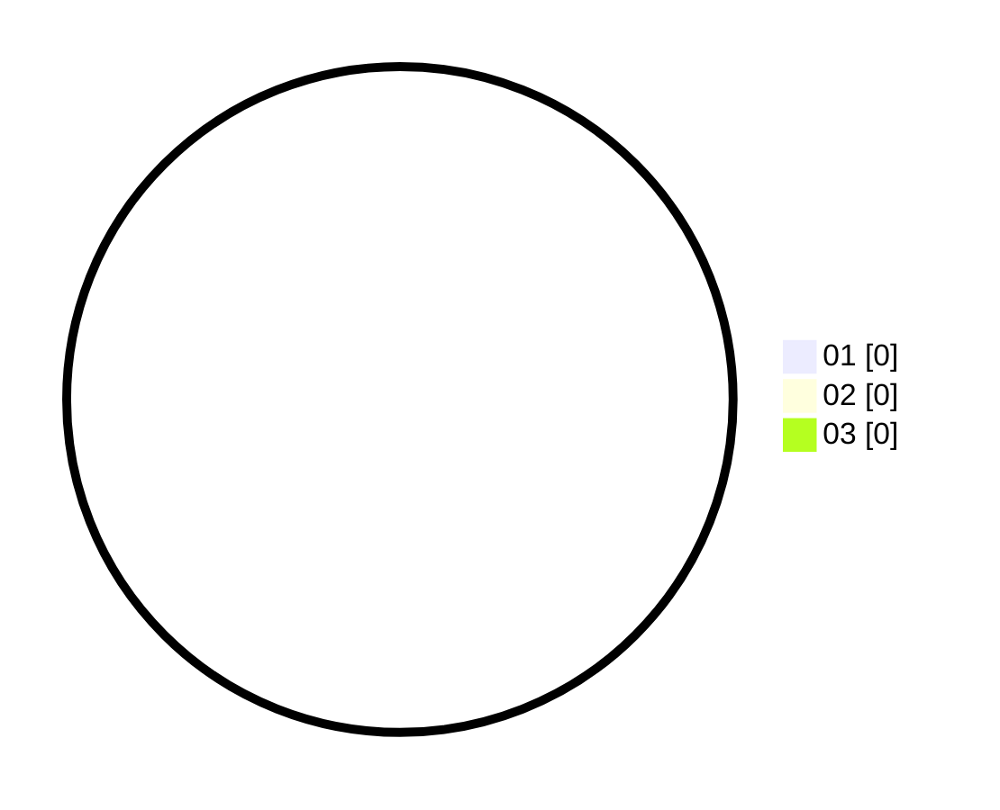

# Hasil

Hasil perolehan suara paslon dapat dilihat pada file paslon-01.txt, paslon-02.txt, dan paslon-03.txt.

Jika tidak ada, artinya data tersebut belum ada pada SIREKAP.

## Perolehan Suara

 * Paslon 01: **0**.
 * Paslon 02: **0**.
 * Paslon 03: **0**.

## Foto C Plano

https://sirekap-obj-formc.kpu.go.id/1384/pemilu/ppwp/31/71/03/10/02/3171031002046-20240216-142320--012ad885-07d8-4802-abb7-1051c8a8b012.jpg

https://sirekap-obj-formc.kpu.go.id/1384/pemilu/ppwp/31/71/03/10/02/3171031002046-20240216-142322--335aaf03-7e74-4978-9783-cf9016a389d0.jpg

https://sirekap-obj-formc.kpu.go.id/1384/pemilu/ppwp/31/71/03/10/02/3171031002046-20240216-142321--c7db2bec-228a-4175-a8bb-272a84cfdefd.jpg

## DATA PEMILIH TETAP

Jumlah pemilih dalam DPT: **254**.
 * L: **133**.
 * P: **121**.

## DATA PENGGUNA HAK PILIH

Jumlah pengguna hak pilih dalam DPT: **178**.
 * L: **88**.
 * P: **90**.

Jumlah pengguna hak pilih dalam DPTb: **0**.
 * L: **0**.
 * P: **0**.

Jumlah pengguna hak pilih dalam DPK: **0**.
 * L: **1**.
 * P: **0**.

Jumlah pengguna hak pilih: **179**.
 * L: **89**.
 * P: **90**.

## JUMLAH SUARA SAH DAN TIDAK SAH

JUMLAH SELURUH SUARA SAH: **176**.

JUMLAH SUARA TIDAK SAH: **3**.

JUMLAH SELURUH SUARA SAH DAN SUARA TIDAK SAH: **179**.
