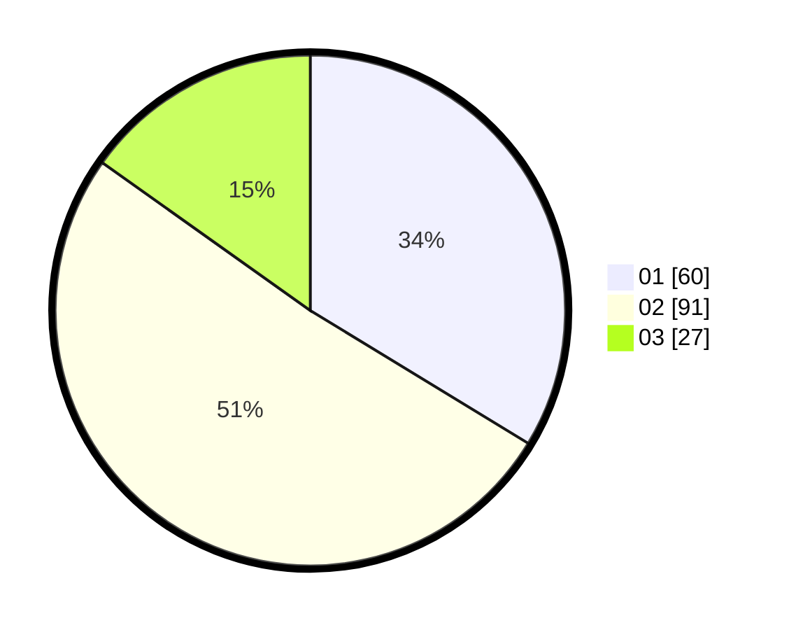

# Hasil

Hasil perolehan suara paslon dapat dilihat pada file paslon-01.txt, paslon-02.txt, dan paslon-03.txt.

Jika tidak ada, artinya data tersebut belum ada pada SIREKAP.

## Perolehan Suara

 * Paslon 01: **60**.
 * Paslon 02: **91**.
 * Paslon 03: **27**.

## Foto C Plano

https://sirekap-obj-formc.kpu.go.id/334f/pemilu/ppwp/31/71/03/10/02/3171031002047-20240216-144031--b3a29331-7021-44ad-9294-488d258a1cc7.jpg

https://sirekap-obj-formc.kpu.go.id/334f/pemilu/ppwp/31/71/03/10/02/3171031002047-20240216-144033--3260b0a8-af5a-4545-949d-eab904f1b018.jpg

https://sirekap-obj-formc.kpu.go.id/334f/pemilu/ppwp/31/71/03/10/02/3171031002047-20240216-144032--3b195573-5551-4f12-abde-f1c0a48ebcf6.jpg

## DATA PEMILIH TETAP

Jumlah pemilih dalam DPT: **240**.
 * L: **125**.
 * P: **115**.

## DATA PENGGUNA HAK PILIH

Jumlah pengguna hak pilih dalam DPT: **175**.
 * L: **87**.
 * P: **88**.

Jumlah pengguna hak pilih dalam DPTb: **1**.
 * L: **0**.
 * P: **1**.

Jumlah pengguna hak pilih dalam DPK: **3**.
 * L: **1**.
 * P: **2**.

Jumlah pengguna hak pilih: **179**.
 * L: **88**.
 * P: **91**.

## JUMLAH SUARA SAH DAN TIDAK SAH

JUMLAH SELURUH SUARA SAH: **178**.

JUMLAH SUARA TIDAK SAH: **1**.

JUMLAH SELURUH SUARA SAH DAN SUARA TIDAK SAH: **179**.
