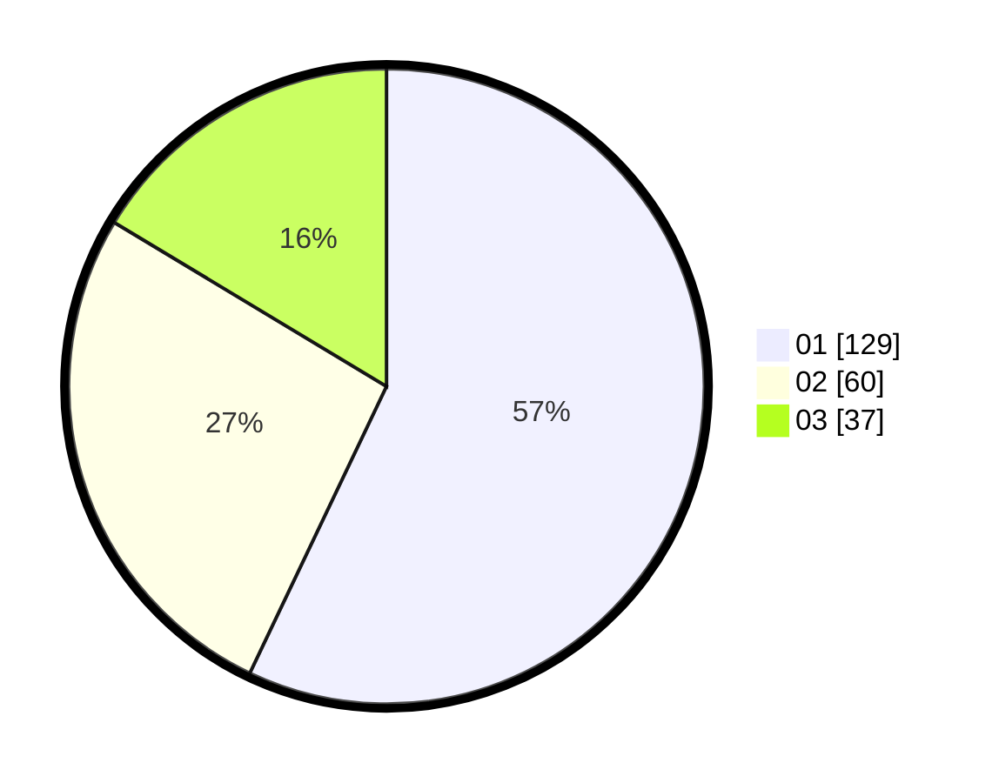

# Hasil

Hasil perolehan suara paslon dapat dilihat pada file paslon-01.txt, paslon-02.txt, dan paslon-03.txt.

Jika tidak ada, artinya data tersebut belum ada pada SIREKAP.

## Perolehan Suara

 * Paslon 01: **129**.
 * Paslon 02: **60**.
 * Paslon 03: **37**.

## Foto C Plano

https://sirekap-obj-formc.kpu.go.id/e2a9/pemilu/ppwp/31/71/03/10/02/3171031002052-20240214-211513--9d9ff512-fefa-45fa-8834-8deb0b17444e.jpg

https://sirekap-obj-formc.kpu.go.id/e2a9/pemilu/ppwp/31/71/03/10/02/3171031002052-20240216-211012--34c0f48f-5dc8-4009-9bbf-fb80f80b4107.jpg

https://sirekap-obj-formc.kpu.go.id/e2a9/pemilu/ppwp/31/71/03/10/02/3171031002052-20240216-211222--35e91482-ac88-4096-87f5-574515ef147b.jpg

## DATA PEMILIH TETAP

Jumlah pemilih dalam DPT: **267**.
 * L: **136**.
 * P: **131**.

## DATA PENGGUNA HAK PILIH

Jumlah pengguna hak pilih dalam DPT: **215**.
 * L: **110**.
 * P: **105**.

Jumlah pengguna hak pilih dalam DPTb: **9**.
 * L: **4**.
 * P: **5**.

Jumlah pengguna hak pilih dalam DPK: **4**.
 * L: **1**.
 * P: **3**.

Jumlah pengguna hak pilih: **228**.
 * L: **115**.
 * P: **113**.

## JUMLAH SUARA SAH DAN TIDAK SAH

JUMLAH SELURUH SUARA SAH: **226**.

JUMLAH SUARA TIDAK SAH: **2**.

JUMLAH SELURUH SUARA SAH DAN SUARA TIDAK SAH: **228**.
