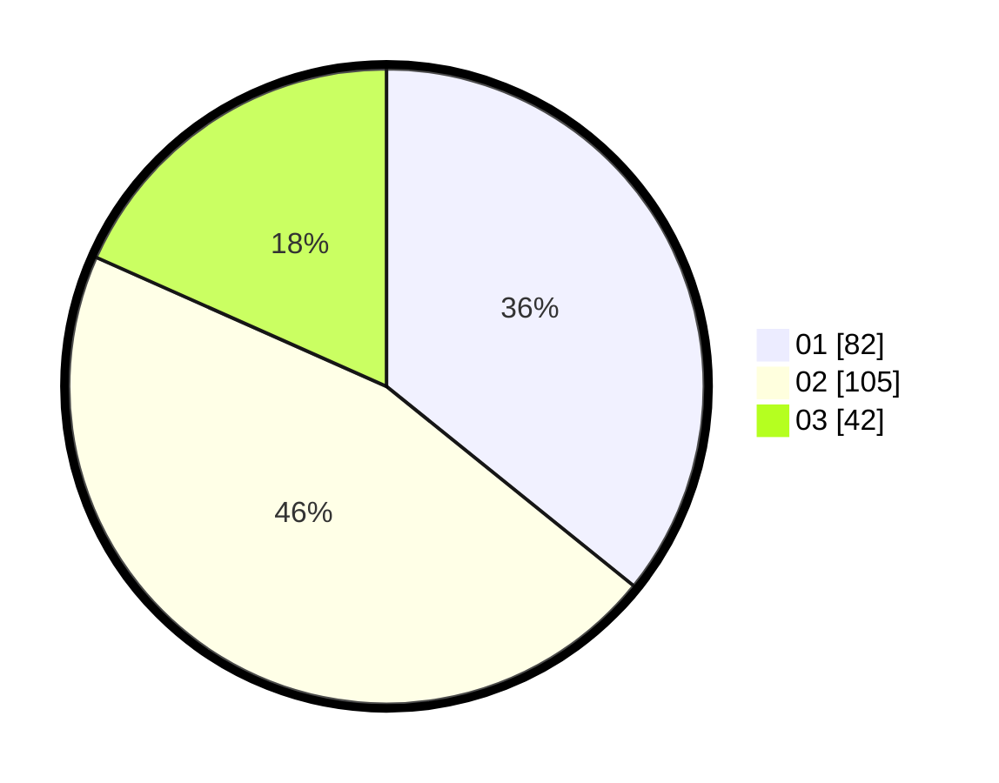

# Hasil

Hasil perolehan suara paslon dapat dilihat pada file paslon-01.txt, paslon-02.txt, dan paslon-03.txt.

Jika tidak ada, artinya data tersebut belum ada pada SIREKAP.

## Perolehan Suara

 * Paslon 01: **82**.
 * Paslon 02: **105**.
 * Paslon 03: **42**.

## Foto C Plano

https://sirekap-obj-formc.kpu.go.id/19b1/pemilu/ppwp/31/71/03/10/02/3171031002055-20240214-202201--bfbf16ba-621e-4c6c-8c56-8bdb284837ec.jpg

https://sirekap-obj-formc.kpu.go.id/19b1/pemilu/ppwp/31/71/03/10/02/3171031002055-20240214-195251--7907b99c-7510-4a1d-b954-dc7ad455429e.jpg

https://sirekap-obj-formc.kpu.go.id/19b1/pemilu/ppwp/31/71/03/10/02/3171031002055-20240214-195351--8eb86666-eb8b-43a5-9ac5-19a1d20c05a5.jpg

## DATA PEMILIH TETAP

Jumlah pemilih dalam DPT: **288**.
 * L: **145**.
 * P: **143**.

## DATA PENGGUNA HAK PILIH

Jumlah pengguna hak pilih dalam DPT: **229**.
 * L: **109**.
 * P: **120**.

Jumlah pengguna hak pilih dalam DPTb: **0**.
 * L: **0**.
 * P: **0**.

Jumlah pengguna hak pilih dalam DPK: **3**.
 * L: **1**.
 * P: **2**.

Jumlah pengguna hak pilih: **232**.
 * L: **110**.
 * P: **122**.

## JUMLAH SUARA SAH DAN TIDAK SAH

JUMLAH SELURUH SUARA SAH: **229**.

JUMLAH SUARA TIDAK SAH: **3**.

JUMLAH SELURUH SUARA SAH DAN SUARA TIDAK SAH: **232**.
