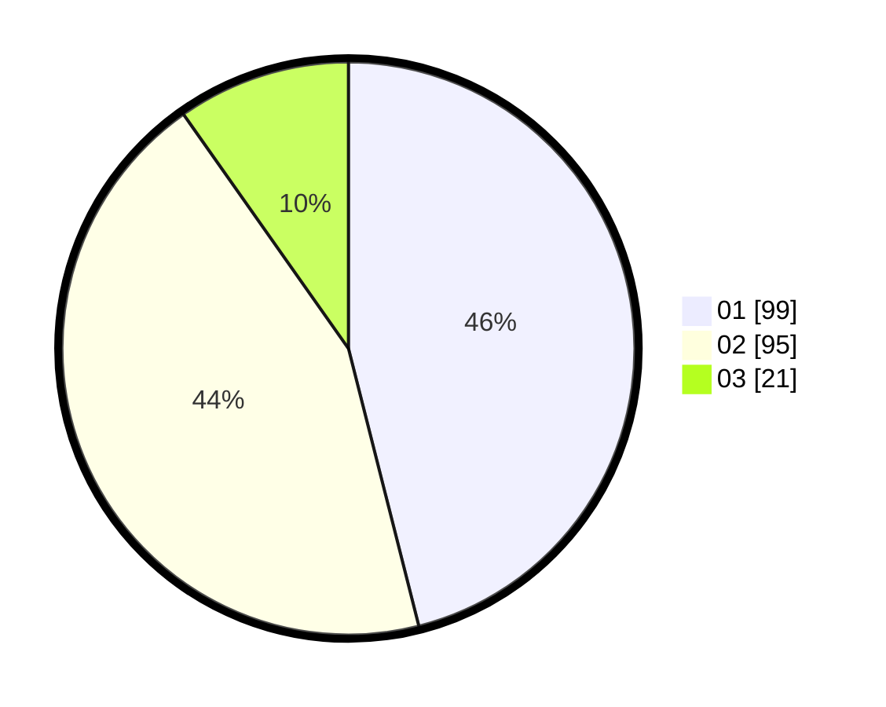

# Hasil

Hasil perolehan suara paslon dapat dilihat pada file paslon-01.txt, paslon-02.txt, dan paslon-03.txt.

Jika tidak ada, artinya data tersebut belum ada pada SIREKAP.

## Perolehan Suara

 * Paslon 01: **99**.
 * Paslon 02: **95**.
 * Paslon 03: **21**.

## Foto C Plano

https://sirekap-obj-formc.kpu.go.id/73bf/pemilu/ppwp/31/71/03/10/02/3171031002058-20240214-202940--4615c8fd-dffa-450d-9a22-70879f4fbb0d.jpg

https://sirekap-obj-formc.kpu.go.id/73bf/pemilu/ppwp/31/71/03/10/02/3171031002058-20240214-202951--2e439837-d32c-4859-8f55-1a1972668cbf.jpg

https://sirekap-obj-formc.kpu.go.id/73bf/pemilu/ppwp/31/71/03/10/02/3171031002058-20240214-202957--37200431-76bf-4254-8358-745e47cd2916.jpg

## DATA PEMILIH TETAP

Jumlah pemilih dalam DPT: **278**.
 * L: **134**.
 * P: **144**.

## DATA PENGGUNA HAK PILIH

Jumlah pengguna hak pilih dalam DPT: **216**.
 * L: **101**.
 * P: **115**.

Jumlah pengguna hak pilih dalam DPTb: **0**.
 * L: **0**.
 * P: **0**.

Jumlah pengguna hak pilih dalam DPK: **0**.
 * L: **0**.
 * P: **0**.

Jumlah pengguna hak pilih: **216**.
 * L: **101**.
 * P: **115**.

## JUMLAH SUARA SAH DAN TIDAK SAH

JUMLAH SELURUH SUARA SAH: **215**.

JUMLAH SUARA TIDAK SAH: **1**.

JUMLAH SELURUH SUARA SAH DAN SUARA TIDAK SAH: **216**.
