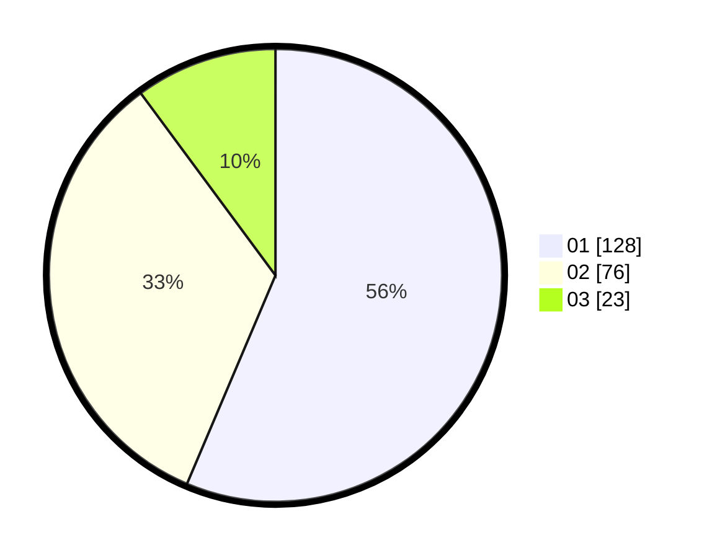

# Hasil

Hasil perolehan suara paslon dapat dilihat pada file paslon-01.txt, paslon-02.txt, dan paslon-03.txt.

Jika tidak ada, artinya data tersebut belum ada pada SIREKAP.

## Perolehan Suara

 * Paslon 01: **128**.
 * Paslon 02: **76**.
 * Paslon 03: **23**.

## Foto C Plano

https://sirekap-obj-formc.kpu.go.id/4c67/pemilu/ppwp/31/71/03/10/02/3171031002060-20240217-173712--fecd5d3e-7763-47d0-846c-202c73c84d56.jpg

https://sirekap-obj-formc.kpu.go.id/4c67/pemilu/ppwp/31/71/03/10/02/3171031002060-20240217-174045--2e2d26a1-311d-4e81-91b8-7d68e57e45cd.jpg

https://sirekap-obj-formc.kpu.go.id/4c67/pemilu/ppwp/31/71/03/10/02/3171031002060-20240217-174617--154e6579-531a-4326-8fd3-2545bb9b5d44.jpg

## DATA PEMILIH TETAP

Jumlah pemilih dalam DPT: **284**.
 * L: **142**.
 * P: **142**.

## DATA PENGGUNA HAK PILIH

Jumlah pengguna hak pilih dalam DPT: **224**.
 * L: **110**.
 * P: **114**.

Jumlah pengguna hak pilih dalam DPTb: **0**.
 * L: **0**.
 * P: **0**.

Jumlah pengguna hak pilih dalam DPK: **5**.
 * L: **1**.
 * P: **4**.

Jumlah pengguna hak pilih: **229**.
 * L: **111**.
 * P: **118**.

## JUMLAH SUARA SAH DAN TIDAK SAH

JUMLAH SELURUH SUARA SAH: **227**.

JUMLAH SUARA TIDAK SAH: **2**.

JUMLAH SELURUH SUARA SAH DAN SUARA TIDAK SAH: **229**.
