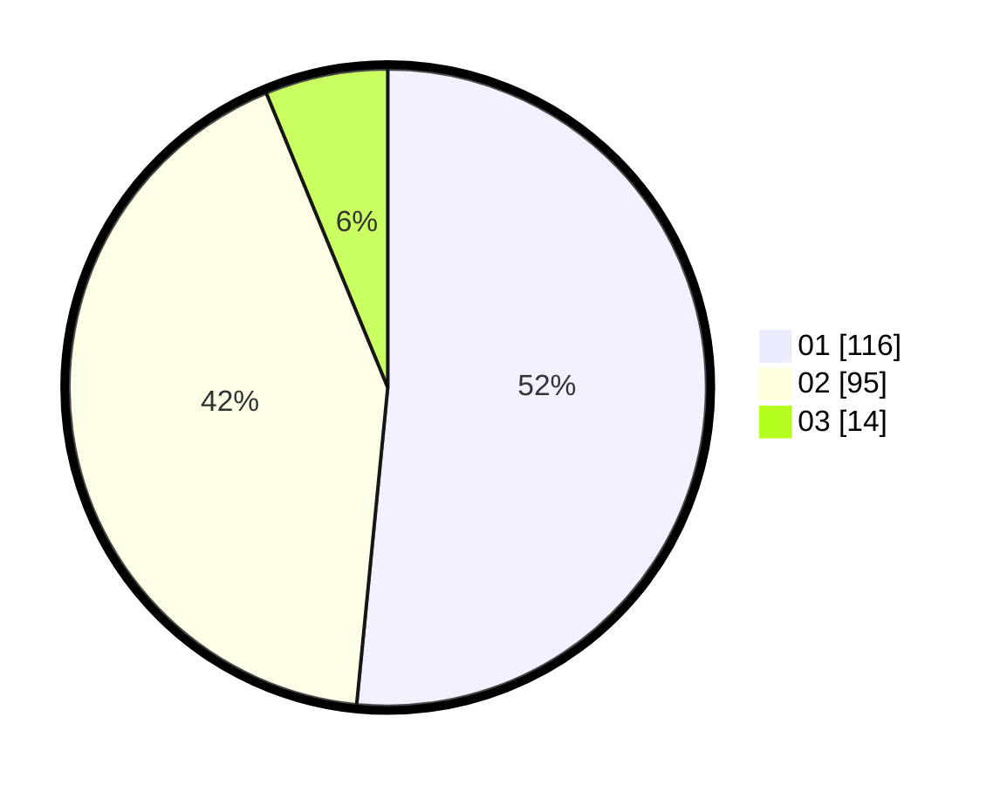

# Hasil

Hasil perolehan suara paslon dapat dilihat pada file paslon-01.txt, paslon-02.txt, dan paslon-03.txt.

Jika tidak ada, artinya data tersebut belum ada pada SIREKAP.

## Perolehan Suara

 * Paslon 01: **116**.
 * Paslon 02: **95**.
 * Paslon 03: **14**.

## Foto C Plano

https://sirekap-obj-formc.kpu.go.id/27dc/pemilu/ppwp/31/71/03/10/02/3171031002062-20240216-135406--b2c44538-2cc9-4f37-b57e-893a5afd9644.jpg

https://sirekap-obj-formc.kpu.go.id/27dc/pemilu/ppwp/31/71/03/10/02/3171031002062-20240216-135407--640848a0-86d6-4294-869b-63db7083b686.jpg

https://sirekap-obj-formc.kpu.go.id/27dc/pemilu/ppwp/31/71/03/10/02/3171031002062-20240216-135406--4a4425c4-53b0-4dfe-bb66-284404513cf4.jpg

## DATA PEMILIH TETAP

Jumlah pemilih dalam DPT: **281**.
 * L: **151**.
 * P: **130**.

## DATA PENGGUNA HAK PILIH

Jumlah pengguna hak pilih dalam DPT: **230**.
 * L: **125**.
 * P: **105**.

Jumlah pengguna hak pilih dalam DPTb: **2**.
 * L: **1**.
 * P: **1**.

Jumlah pengguna hak pilih dalam DPK: **0**.
 * L: **0**.
 * P: **0**.

Jumlah pengguna hak pilih: **232**.
 * L: **126**.
 * P: **106**.

## JUMLAH SUARA SAH DAN TIDAK SAH

JUMLAH SELURUH SUARA SAH: **225**.

JUMLAH SUARA TIDAK SAH: **7**.

JUMLAH SELURUH SUARA SAH DAN SUARA TIDAK SAH: **232**.
