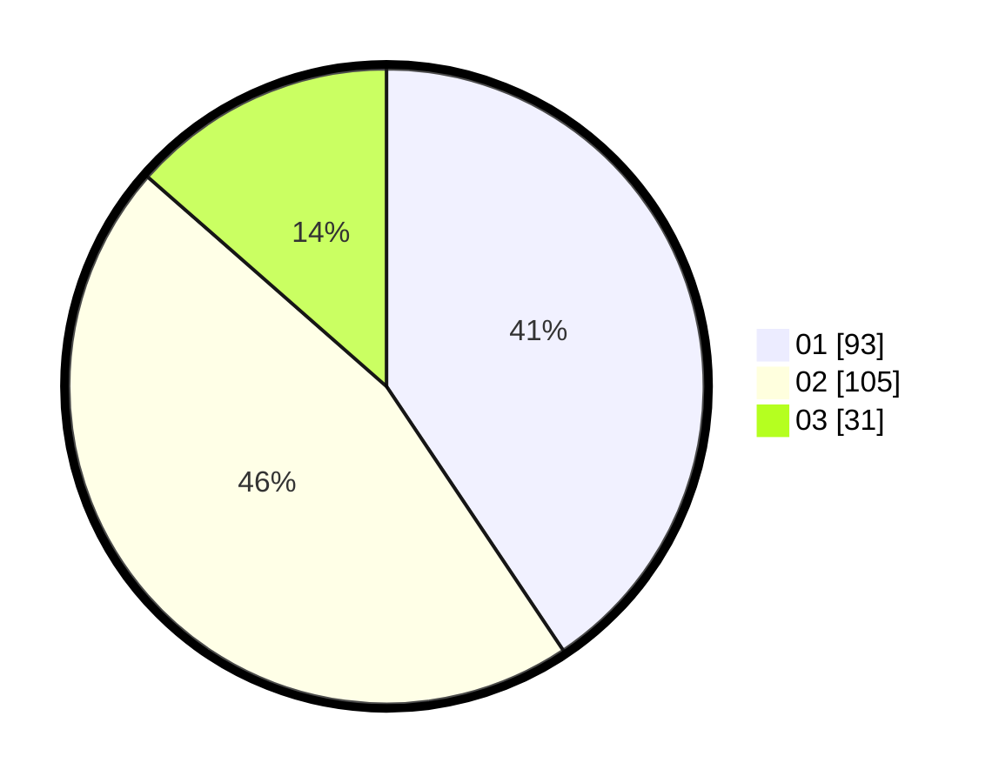

# Hasil

Hasil perolehan suara paslon dapat dilihat pada file paslon-01.txt, paslon-02.txt, dan paslon-03.txt.

Jika tidak ada, artinya data tersebut belum ada pada SIREKAP.

## Perolehan Suara

 * Paslon 01: **93**.
 * Paslon 02: **105**.
 * Paslon 03: **31**.

## Foto C Plano

https://sirekap-obj-formc.kpu.go.id/de59/pemilu/ppwp/31/71/03/10/02/3171031002063-20240214-192040--45a0b7e0-f682-4949-bd29-7bbbc7e6a1f1.jpg

https://sirekap-obj-formc.kpu.go.id/de59/pemilu/ppwp/31/71/03/10/02/3171031002063-20240214-191501--3ef6c2c5-63c8-45ae-ae11-3d735086e2c6.jpg

https://sirekap-obj-formc.kpu.go.id/de59/pemilu/ppwp/31/71/03/10/02/3171031002063-20240214-193221--80d2f087-81b4-43b5-8418-b436ede2d39a.jpg

## DATA PEMILIH TETAP

Jumlah pemilih dalam DPT: **285**.
 * L: **138**.
 * P: **147**.

## DATA PENGGUNA HAK PILIH

Jumlah pengguna hak pilih dalam DPT: **231**.
 * L: **113**.
 * P: **118**.

Jumlah pengguna hak pilih dalam DPTb: **0**.
 * L: **0**.
 * P: **0**.

Jumlah pengguna hak pilih dalam DPK: **0**.
 * L: **0**.
 * P: **0**.

Jumlah pengguna hak pilih: **231**.
 * L: **113**.
 * P: **118**.

## JUMLAH SUARA SAH DAN TIDAK SAH

JUMLAH SELURUH SUARA SAH: **229**.

JUMLAH SUARA TIDAK SAH: **2**.

JUMLAH SELURUH SUARA SAH DAN SUARA TIDAK SAH: **231**.
