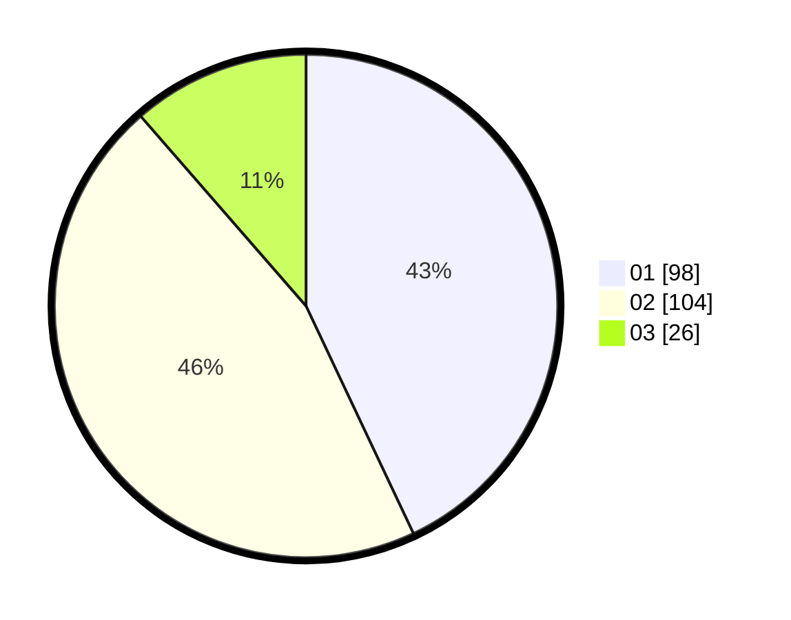

# Hasil

Hasil perolehan suara paslon dapat dilihat pada file paslon-01.txt, paslon-02.txt, dan paslon-03.txt.

Jika tidak ada, artinya data tersebut belum ada pada SIREKAP.

## Perolehan Suara

 * Paslon 01: **98**.
 * Paslon 02: **104**.
 * Paslon 03: **26**.

## Foto C Plano

https://sirekap-obj-formc.kpu.go.id/53a9/pemilu/ppwp/31/71/03/10/02/3171031002066-20240216-174851--4cb952ad-cce6-4356-b4b1-e8ea4ccb717d.jpg

https://sirekap-obj-formc.kpu.go.id/53a9/pemilu/ppwp/31/71/03/10/02/3171031002066-20240216-195622--0b7b67c0-784a-4030-b7f5-45762cc3e671.jpg

https://sirekap-obj-formc.kpu.go.id/53a9/pemilu/ppwp/31/71/03/10/02/3171031002066-20240216-195230--fa1d4921-ff95-4593-b9fa-966019d541cd.jpg

## DATA PEMILIH TETAP

Jumlah pemilih dalam DPT: **292**.
 * L: **152**.
 * P: **140**.

## DATA PENGGUNA HAK PILIH

Jumlah pengguna hak pilih dalam DPT: **225**.
 * L: **111**.
 * P: **114**.

Jumlah pengguna hak pilih dalam DPTb: **0**.
 * L: **0**.
 * P: **0**.

Jumlah pengguna hak pilih dalam DPK: **3**.
 * L: **2**.
 * P: **1**.

Jumlah pengguna hak pilih: **228**.
 * L: **113**.
 * P: **115**.

## JUMLAH SUARA SAH DAN TIDAK SAH

JUMLAH SELURUH SUARA SAH: **228**.

JUMLAH SUARA TIDAK SAH: **0**.

JUMLAH SELURUH SUARA SAH DAN SUARA TIDAK SAH: **228**.
