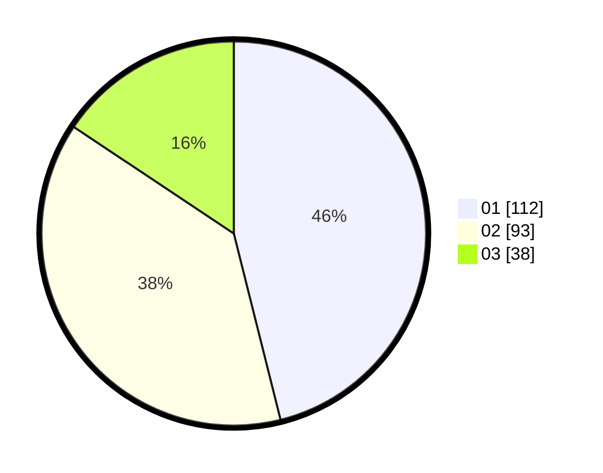

# Hasil

Hasil perolehan suara paslon dapat dilihat pada file paslon-01.txt, paslon-02.txt, dan paslon-03.txt.

Jika tidak ada, artinya data tersebut belum ada pada SIREKAP.

## Perolehan Suara

 * Paslon 01: **112**.
 * Paslon 02: **93**.
 * Paslon 03: **38**.

## Foto C Plano

https://sirekap-obj-formc.kpu.go.id/542a/pemilu/ppwp/31/71/03/10/02/3171031002067-20240214-230219--da3e60aa-9ccf-4935-9b4a-22f19447ea49.jpg

https://sirekap-obj-formc.kpu.go.id/542a/pemilu/ppwp/31/71/03/10/02/3171031002067-20240214-230045--895043b7-cfbc-47f6-bacc-fd4040b1d768.jpg

https://sirekap-obj-formc.kpu.go.id/542a/pemilu/ppwp/31/71/03/10/02/3171031002067-20240215-143144--03eda846-6c8c-4522-872c-569e5fbf5e17.jpg

## DATA PEMILIH TETAP

Jumlah pemilih dalam DPT: **296**.
 * L: **149**.
 * P: **147**.

## DATA PENGGUNA HAK PILIH

Jumlah pengguna hak pilih dalam DPT: **247**.
 * L: **121**.
 * P: **126**.

Jumlah pengguna hak pilih dalam DPTb: **0**.
 * L: **0**.
 * P: **0**.

Jumlah pengguna hak pilih dalam DPK: **1**.
 * L: **1**.
 * P: **0**.

Jumlah pengguna hak pilih: **248**.
 * L: **122**.
 * P: **126**.

## JUMLAH SUARA SAH DAN TIDAK SAH

JUMLAH SELURUH SUARA SAH: **243**.

JUMLAH SUARA TIDAK SAH: **5**.

JUMLAH SELURUH SUARA SAH DAN SUARA TIDAK SAH: **248**.
