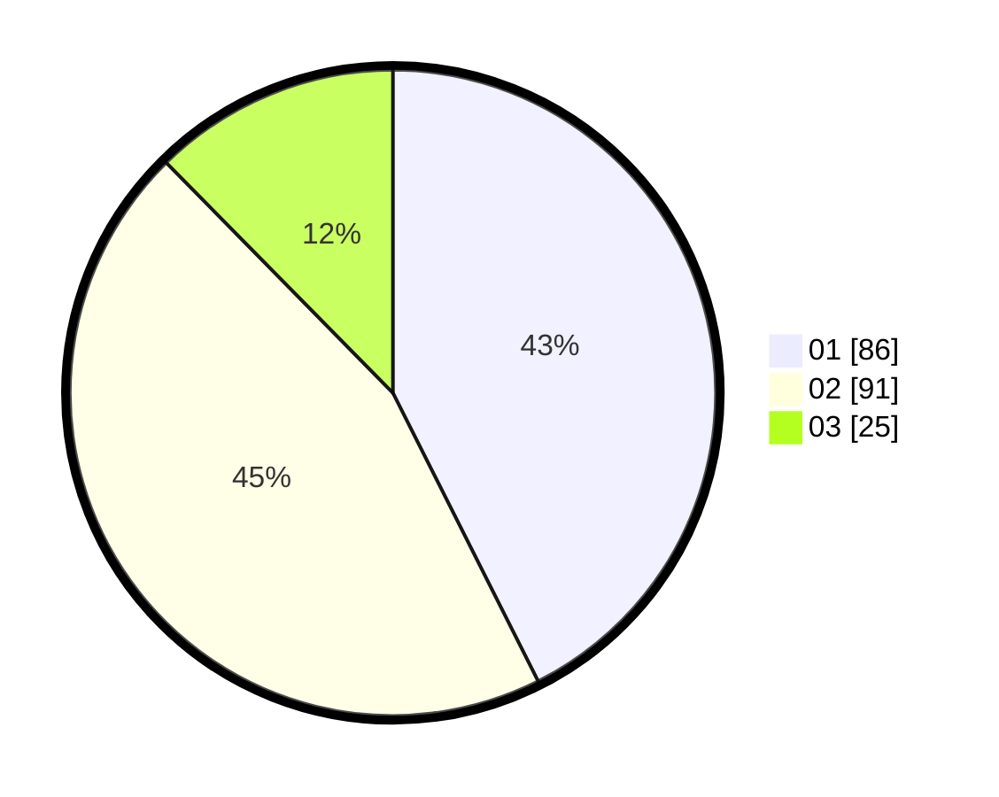

# Hasil

Hasil perolehan suara paslon dapat dilihat pada file paslon-01.txt, paslon-02.txt, dan paslon-03.txt.

Jika tidak ada, artinya data tersebut belum ada pada SIREKAP.

## Perolehan Suara

 * Paslon 01: **86**.
 * Paslon 02: **91**.
 * Paslon 03: **25**.

## Foto C Plano

https://sirekap-obj-formc.kpu.go.id/a5b2/pemilu/ppwp/31/71/03/10/02/3171031002069-20240214-195134--3ef420b2-33b9-4fef-b97f-ac16904c0da4.jpg

https://sirekap-obj-formc.kpu.go.id/a5b2/pemilu/ppwp/31/71/03/10/02/3171031002069-20240214-190434--33fdb524-2653-4df6-abf9-fb0999fdf4d7.jpg

https://sirekap-obj-formc.kpu.go.id/a5b2/pemilu/ppwp/31/71/03/10/02/3171031002069-20240214-191844--f1b67c20-092a-4897-90b1-3cd4955d8775.jpg
