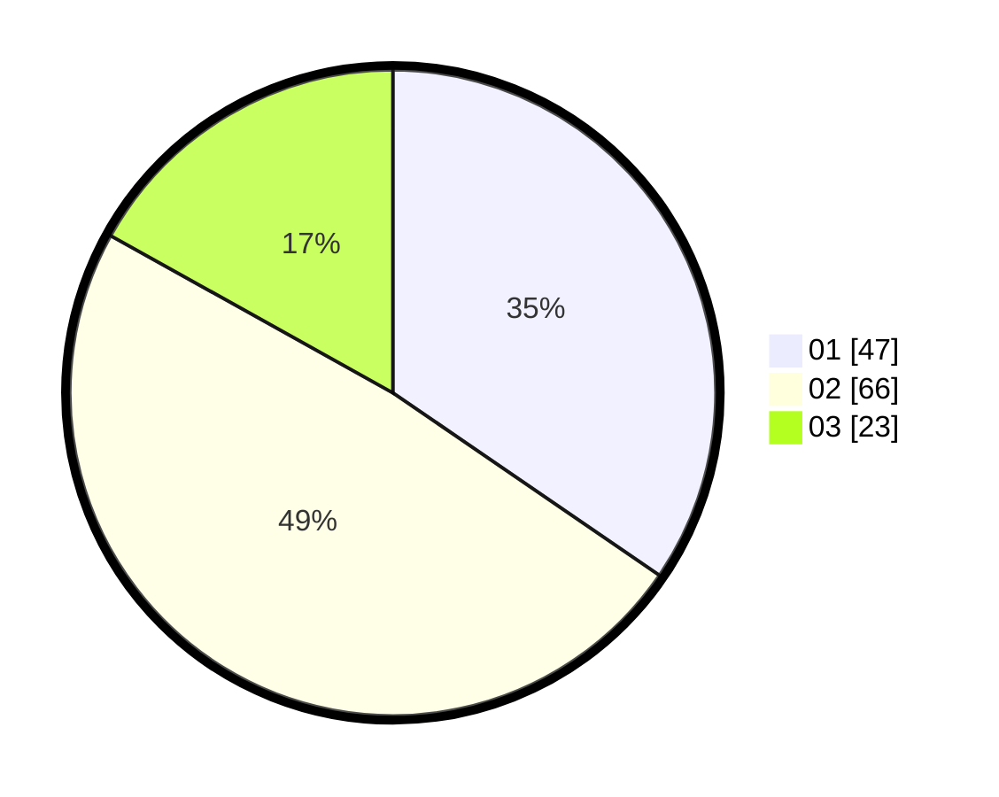

# Hasil

Hasil perolehan suara paslon dapat dilihat pada file paslon-01.txt, paslon-02.txt, dan paslon-03.txt.

Jika tidak ada, artinya data tersebut belum ada pada SIREKAP.

## Perolehan Suara

 * Paslon 01: **47**.
 * Paslon 02: **66**.
 * Paslon 03: **23**.

## Foto C Plano

https://sirekap-obj-formc.kpu.go.id/1cf9/pemilu/ppwp/31/71/03/10/02/3171031002075-20240216-225138--f1dddc58-3fe2-4163-8115-d28ca9cd63d1.jpg

https://sirekap-obj-formc.kpu.go.id/1cf9/pemilu/ppwp/31/71/03/10/02/3171031002075-20240216-235843--75470a35-bff3-4a75-8738-7baf4e54702e.jpg

https://sirekap-obj-formc.kpu.go.id/1cf9/pemilu/ppwp/31/71/03/10/02/3171031002075-20240216-230044--910f25fe-bb47-4393-a8bb-ce4912a68e24.jpg

## DATA PEMILIH TETAP

Jumlah pemilih dalam DPT: **220**.
 * L: **118**.
 * P: **102**.

## DATA PENGGUNA HAK PILIH

Jumlah pengguna hak pilih dalam DPT: **133**.
 * L: **68**.
 * P: **65**.

Jumlah pengguna hak pilih dalam DPTb: **6**.
 * L: **2**.
 * P: **4**.

Jumlah pengguna hak pilih dalam DPK: **0**.
 * L: **0**.
 * P: **0**.

Jumlah pengguna hak pilih: **139**.
 * L: **70**.
 * P: **69**.

## JUMLAH SUARA SAH DAN TIDAK SAH

JUMLAH SELURUH SUARA SAH: **136**.

JUMLAH SUARA TIDAK SAH: **3**.

JUMLAH SELURUH SUARA SAH DAN SUARA TIDAK SAH: **139**.
