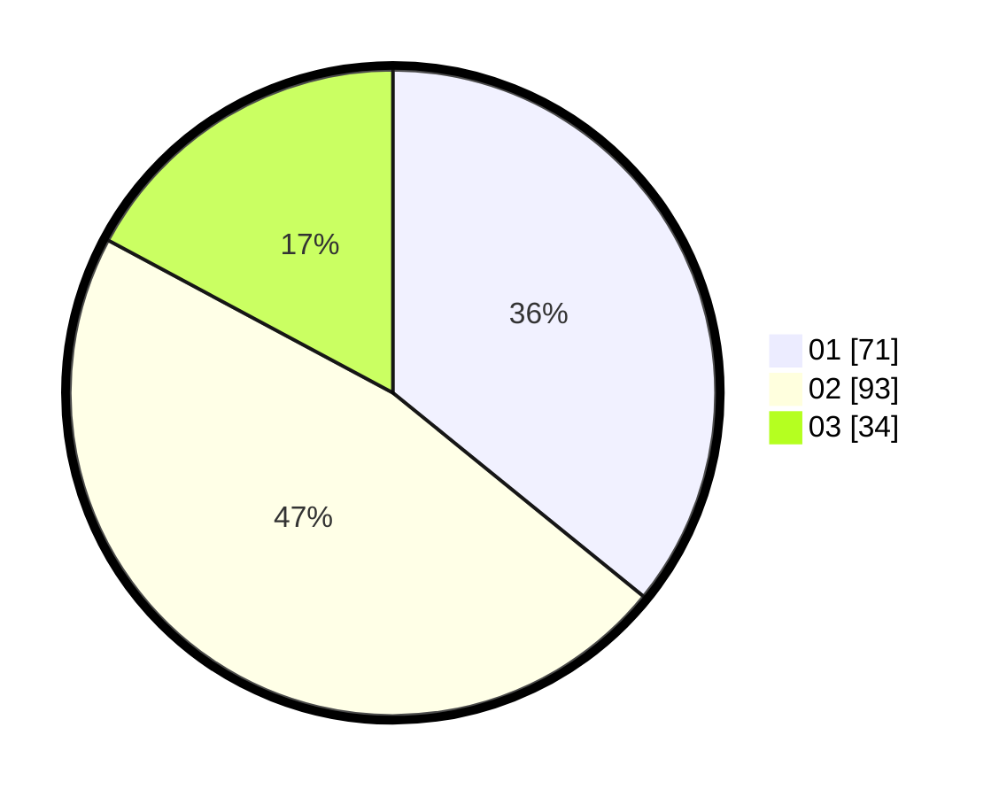

# Hasil

Hasil perolehan suara paslon dapat dilihat pada file paslon-01.txt, paslon-02.txt, dan paslon-03.txt.

Jika tidak ada, artinya data tersebut belum ada pada SIREKAP.

## Perolehan Suara

 * Paslon 01: **71**.
 * Paslon 02: **93**.
 * Paslon 03: **34**.

## Foto C Plano

https://sirekap-obj-formc.kpu.go.id/fee0/pemilu/ppwp/31/71/03/10/02/3171031002076-20240214-233923--ee7ecdfc-2365-4e15-aaf3-1f6849041e77.jpg

https://sirekap-obj-formc.kpu.go.id/fee0/pemilu/ppwp/31/71/03/10/02/3171031002076-20240214-234034--7626a381-0ea8-4785-8556-cf99dad24c23.jpg

https://sirekap-obj-formc.kpu.go.id/fee0/pemilu/ppwp/31/71/03/10/02/3171031002076-20240214-234135--36c09192-cc39-448e-96e4-1337cd492119.jpg
