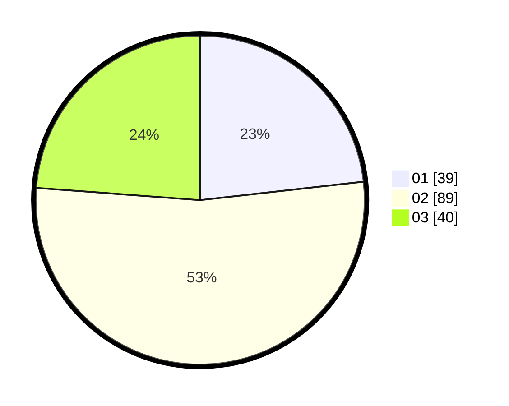

# Hasil

Hasil perolehan suara paslon dapat dilihat pada file paslon-01.txt, paslon-02.txt, dan paslon-03.txt.

Jika tidak ada, artinya data tersebut belum ada pada SIREKAP.

## Perolehan Suara

 * Paslon 01: **39**.
 * Paslon 02: **89**.
 * Paslon 03: **40**.

## Foto C Plano

https://sirekap-obj-formc.kpu.go.id/2b5e/pemilu/ppwp/31/71/03/10/02/3171031002079-20240215-210331--23b9509a-b6a6-4b9f-8f1c-6483cf6e1520.jpg

https://sirekap-obj-formc.kpu.go.id/2b5e/pemilu/ppwp/31/71/03/10/02/3171031002079-20240214-231733--d966c98d-57e6-4f85-ab98-0210d39eb693.jpg

https://sirekap-obj-formc.kpu.go.id/2b5e/pemilu/ppwp/31/71/03/10/02/3171031002079-20240214-231816--b8bb1d4a-6d34-44c1-ae2a-6aba5d73b777.jpg

## DATA PEMILIH TETAP

Jumlah pemilih dalam DPT: **248**.
 * L: **109**.
 * P: **139**.

## DATA PENGGUNA HAK PILIH

Jumlah pengguna hak pilih dalam DPT: **156**.
 * L: **73**.
 * P: **83**.

Jumlah pengguna hak pilih dalam DPTb: **0**.
 * L: **0**.
 * P: **0**.

Jumlah pengguna hak pilih dalam DPK: **16**.
 * L: **9**.
 * P: **7**.

Jumlah pengguna hak pilih: **172**.
 * L: **82**.
 * P: **90**.

## JUMLAH SUARA SAH DAN TIDAK SAH

JUMLAH SELURUH SUARA SAH: **168**.

JUMLAH SUARA TIDAK SAH: **4**.

JUMLAH SELURUH SUARA SAH DAN SUARA TIDAK SAH: **172**.
