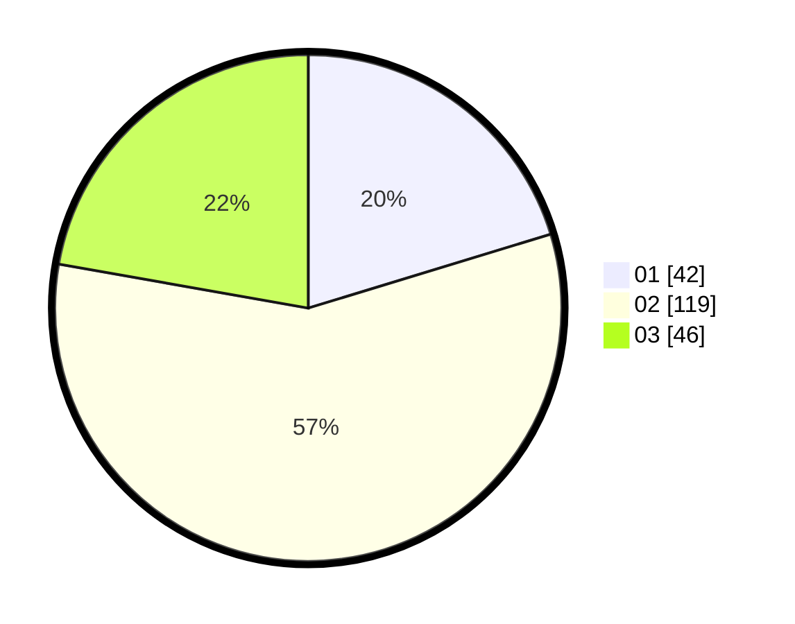

# Hasil

Hasil perolehan suara paslon dapat dilihat pada file paslon-01.txt, paslon-02.txt, dan paslon-03.txt.

Jika tidak ada, artinya data tersebut belum ada pada SIREKAP.

## Perolehan Suara

 * Paslon 01: **42**.
 * Paslon 02: **119**.
 * Paslon 03: **46**.

## Foto C Plano

https://sirekap-obj-formc.kpu.go.id/6892/pemilu/ppwp/31/71/03/10/02/3171031002090-20240216-101651--edbccf58-edd7-4441-839b-27459f4b9eea.jpg

https://sirekap-obj-formc.kpu.go.id/6892/pemilu/ppwp/31/71/03/10/02/3171031002090-20240214-155825--9a39c8e8-89d6-4338-9bc0-8c372de69430.jpg

https://sirekap-obj-formc.kpu.go.id/6892/pemilu/ppwp/31/71/03/10/02/3171031002090-20240216-192603--da02c3a1-0f38-4652-8be1-6639ea790916.jpg
