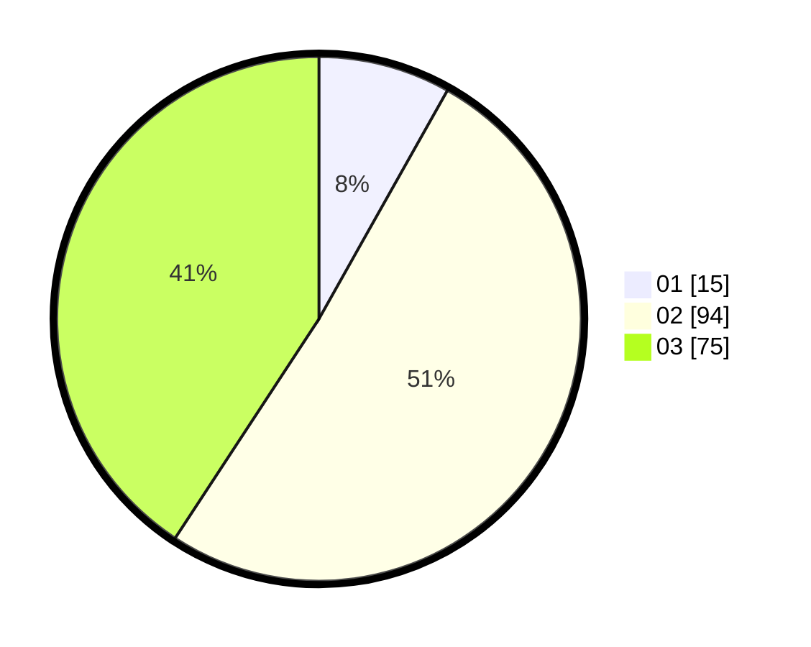

# Hasil

Hasil perolehan suara paslon dapat dilihat pada file paslon-01.txt, paslon-02.txt, dan paslon-03.txt.

Jika tidak ada, artinya data tersebut belum ada pada SIREKAP.

## Perolehan Suara

 * Paslon 01: **15**.
 * Paslon 02: **94**.
 * Paslon 03: **75**.

## Foto C Plano

https://sirekap-obj-formc.kpu.go.id/82a8/pemilu/ppwp/31/71/03/10/02/3171031002095-20240216-150543--d7855702-3eb7-47ef-9003-6a4bcd70de7e.jpg

https://sirekap-obj-formc.kpu.go.id/82a8/pemilu/ppwp/31/71/03/10/02/3171031002095-20240216-150544--ee581d51-7690-4348-81a1-94d8eb3f05d2.jpg

https://sirekap-obj-formc.kpu.go.id/82a8/pemilu/ppwp/31/71/03/10/02/3171031002095-20240216-150544--7efdcf4a-dcbb-448f-8409-f0f77854595c.jpg

## DATA PEMILIH TETAP

Jumlah pemilih dalam DPT: **266**.
 * L: **124**.
 * P: **142**.

## DATA PENGGUNA HAK PILIH

Jumlah pengguna hak pilih dalam DPT: **164**.
 * L: **75**.
 * P: **89**.

Jumlah pengguna hak pilih dalam DPTb: **12**.
 * L: **7**.
 * P: **5**.

Jumlah pengguna hak pilih dalam DPK: **8**.
 * L: **2**.
 * P: **6**.

Jumlah pengguna hak pilih: **184**.
 * L: **84**.
 * P: **100**.

## JUMLAH SUARA SAH DAN TIDAK SAH

JUMLAH SELURUH SUARA SAH: **184**.

JUMLAH SUARA TIDAK SAH: **0**.

JUMLAH SELURUH SUARA SAH DAN SUARA TIDAK SAH: **184**.
