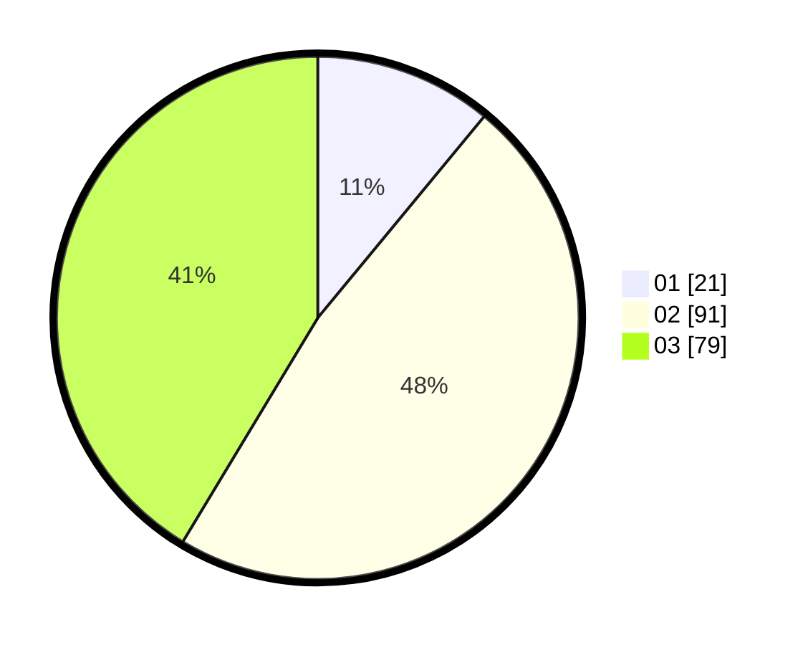

# Hasil

Hasil perolehan suara paslon dapat dilihat pada file paslon-01.txt, paslon-02.txt, dan paslon-03.txt.

Jika tidak ada, artinya data tersebut belum ada pada SIREKAP.

## Perolehan Suara

 * Paslon 01: **21**.
 * Paslon 02: **91**.
 * Paslon 03: **79**.

## Foto C Plano

https://sirekap-obj-formc.kpu.go.id/76fc/pemilu/ppwp/31/71/03/10/02/3171031002103-20240216-144353--ecd0af8f-6eb5-465d-85ee-e184cb361f42.jpg

https://sirekap-obj-formc.kpu.go.id/76fc/pemilu/ppwp/31/71/03/10/02/3171031002103-20240214-221855--ba05f804-98cb-4c58-85c9-9b1c0f4fc3b8.jpg

https://sirekap-obj-formc.kpu.go.id/76fc/pemilu/ppwp/31/71/03/10/02/3171031002103-20240214-221918--a3748478-c085-4e46-bf85-327366b58958.jpg

## DATA PEMILIH TETAP

Jumlah pemilih dalam DPT: **285**.
 * L: **119**.
 * P: **166**.

## DATA PENGGUNA HAK PILIH

Jumlah pengguna hak pilih dalam DPT: **166**.
 * L: **65**.
 * P: **101**.

Jumlah pengguna hak pilih dalam DPTb: **20**.
 * L: **13**.
 * P: **7**.

Jumlah pengguna hak pilih dalam DPK: **6**.
 * L: **4**.
 * P: **2**.

Jumlah pengguna hak pilih: **192**.
 * L: **82**.
 * P: **110**.

## JUMLAH SUARA SAH DAN TIDAK SAH

JUMLAH SELURUH SUARA SAH: **191**.

JUMLAH SUARA TIDAK SAH: **1**.

JUMLAH SELURUH SUARA SAH DAN SUARA TIDAK SAH: **192**.
