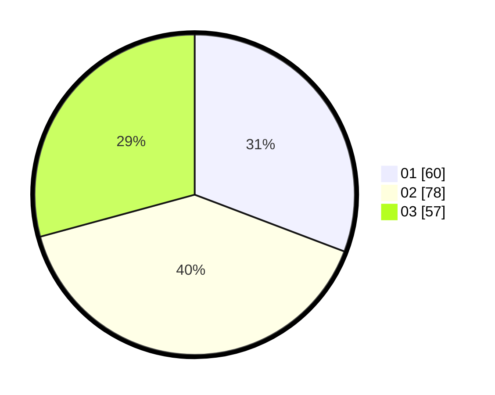

# Hasil

Hasil perolehan suara paslon dapat dilihat pada file paslon-01.txt, paslon-02.txt, dan paslon-03.txt.

Jika tidak ada, artinya data tersebut belum ada pada SIREKAP.

## Perolehan Suara

 * Paslon 01: **60**.
 * Paslon 02: **78**.
 * Paslon 03: **57**.

## Foto C Plano

https://sirekap-obj-formc.kpu.go.id/29a9/pemilu/ppwp/31/71/03/10/03/3171031003011-20240214-234307--6ff8f9f9-9aef-46f5-a47d-3c5b81ba7767.jpg

https://sirekap-obj-formc.kpu.go.id/29a9/pemilu/ppwp/31/71/03/10/03/3171031003011-20240214-234409--bd7ead67-131a-4462-9bb5-bfa2d35b7ae1.jpg

https://sirekap-obj-formc.kpu.go.id/29a9/pemilu/ppwp/31/71/03/10/03/3171031003011-20240214-234457--3f69adcc-85db-4b94-b6a1-db01e39cb403.jpg
